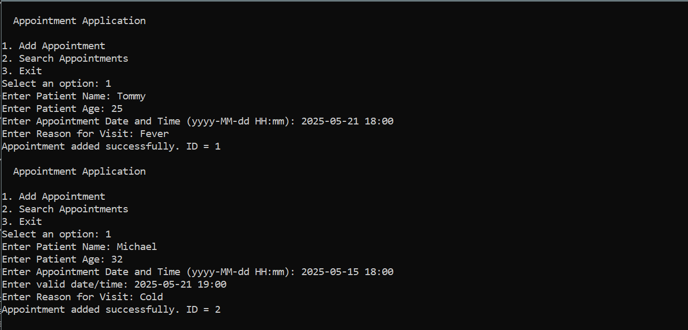
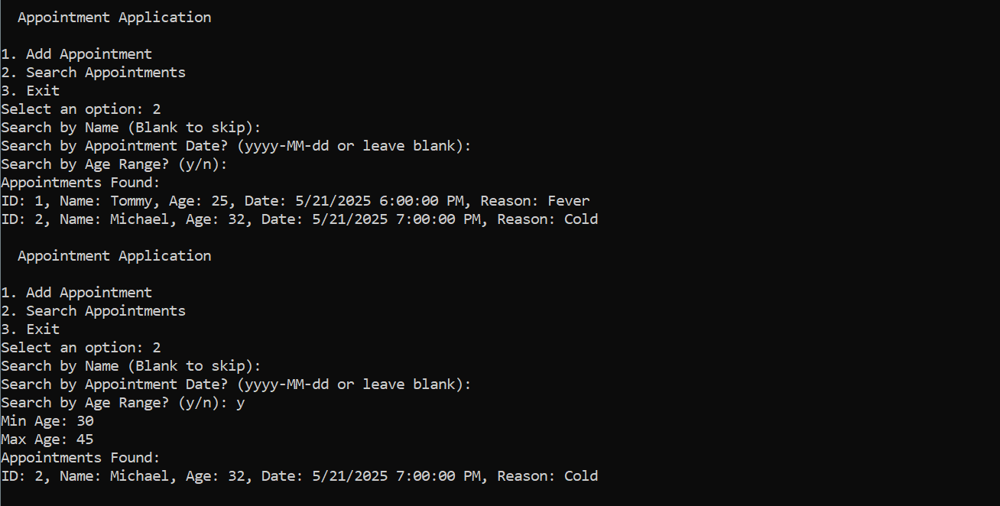
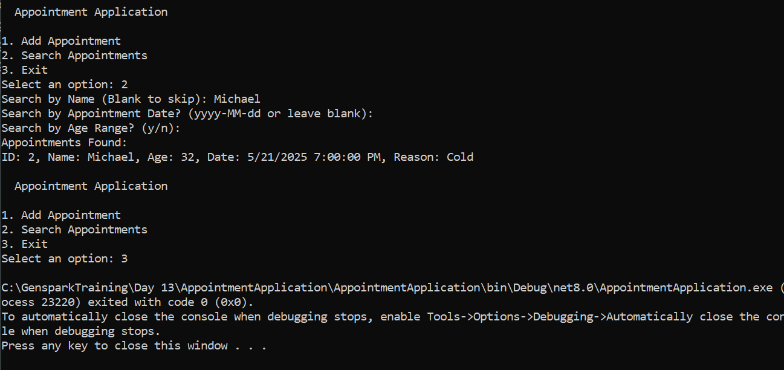

# Appointment Booking Console Application

This is a simple **C# Console Application** for managing appointments. Users can schedule appointments by entering valid details, and the application ensures that the appointment date and time are **set in the future**.

---

## Features

- Add a new appointment with:
  - Appointment ID
  - Patient Name
  - Doctor Name
  - Appointment Date and Time (must be in the future)
- Input validation with user-friendly prompts
- Displays success or error messages in the console

---

## Technologies Used

- C#
- .NET Console Application

---

## Output

