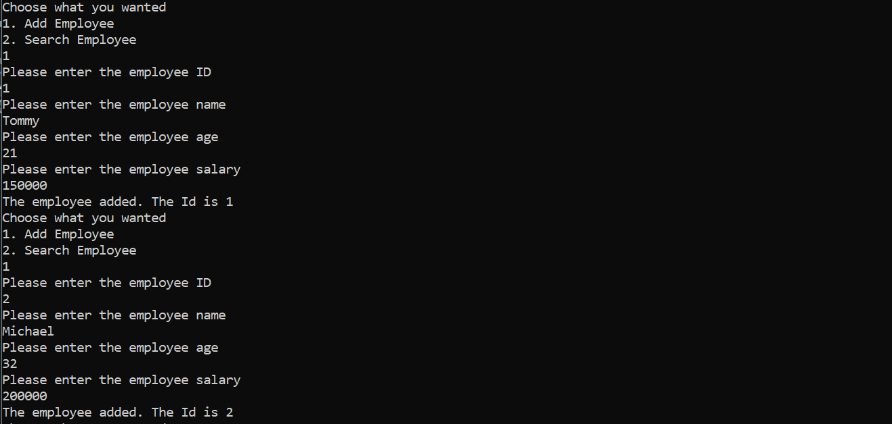
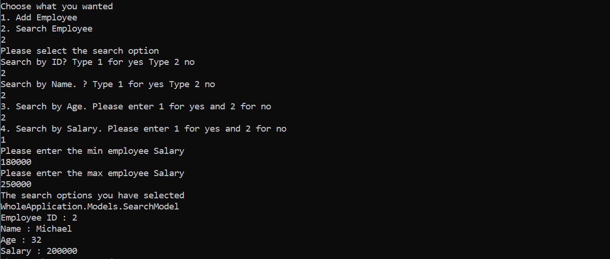

# Employee Management System (Console App)

This is a simple **Console-Based Employee Management System** written in **C#** using **OOP principles, interfaces, and layered architecture**. The system allows you to:

- Add new employees
- Search employees based on:
  - ID
  - Name
  - Age range
  - Salary range

---

---

## Features

- **Add Employees:** Input employee details and persist them in memory.
- **Search Employees:** Multi-criteria search:
  - By ID
  - By Name
  - By Age (Min and Max)
  - By Salary (Min and Max)

---

## Technologies Used

- C# (.NET Core or .NET Framework)
- Object-Oriented Programming
- Interfaces and Abstraction
- Console Input/Output
- Exception Handling

---

## Output

