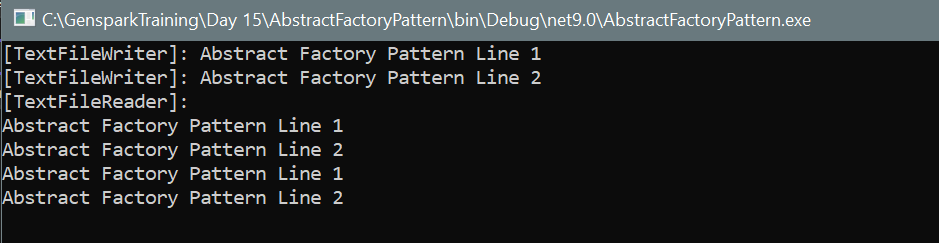

# Abstract Factory Pattern in C#

This project demonstrates the **Abstract Factory Design Pattern** in C#. It provides an interface for creating families of related or dependent objects without specifying their concrete classes. The pattern is particularly useful when a system needs to be independent of how its products are created, composed, and represented.

---

##  Design Pattern

**Pattern**: `Abstract Factory Pattern`

- **Purpose**: Create families of related objects without depending on their concrete classes.
- **Key Benefit**: Ensures consistency among products that are used together, and makes it easier to switch between different product families.

---

## Output

