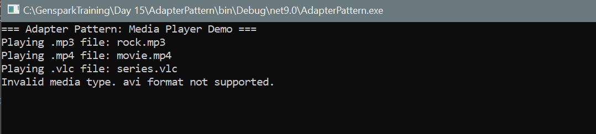

# Media Adapter Pattern (C# Console Application)

This application demonstrates the **Adapter Design Pattern** using a real-world analogy of a media player that supports multiple file formats via an adapter. The pattern allows incompatible interfaces to work together without changing their existing code.

---

## Design Pattern: Adapter

The **Adapter Pattern** acts as a bridge between two incompatible interfaces. It enables a system to use classes whose interfaces are not directly compatible by introducing an adapter class that converts the interface of a class into another interface the client expects.

---

## Components

| Component          | Role                                        |
|--------------------|---------------------------------------------|
| `IMediaPlayer`     | Target interface expected by the client     |
| `AdvancedMediaPlayer` | Adaptee class with advanced format support |
| `MediaAdapter`     | Adapter that translates client requests     |
| `AudioPlayer`      | Client class using the adapter              |
| `Program.cs`       | Demonstrates usage of the adapter           |

## Output

