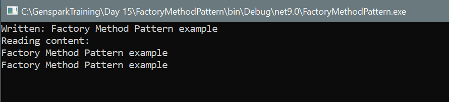

# Factory Method Pattern in C#

This repository demonstrates the **Factory Method Design Pattern** in C#. The Factory Method pattern defines an interface for creating an object but lets subclasses decide which class to instantiate. It promotes loose coupling by eliminating the need to bind application-specific classes into your code.

---

## Design Pattern

**Pattern**: `Factory Method Pattern`

- **Purpose**: Delegate the instantiation of objects to subclasses.
- **Key Benefit**: Decouples client code from concrete classes and allows new types to be introduced without modifying existing code.

---

## Output

