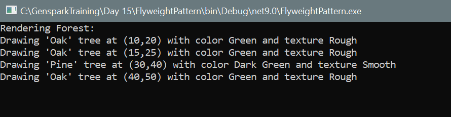

# Flyweight Design Pattern - C# Console Application

This project demonstrates the **Flyweight Design Pattern** using a real-world scenario of rendering multiple trees in a forest. The goal is to **reduce memory usage** by sharing common data (intrinsic state) among multiple objects, while keeping unique data (extrinsic state) separate.

---

## Pattern Intent

> Use sharing to support large numbers of fine-grained objects efficiently.

---

## Scenario: Forest Rendering System

Imagine rendering thousands of trees in a forest. Each tree has:
- A **type** (name, color, texture) → _shared among similar trees (Flyweight)_
- A **position** (x, y) → _unique to each tree (Extrinsic data)_

---

##  Components

### `TreeType.cs` (Flyweight)
Represents the shared data for a tree (name, color, texture).

### `TreeFactory.cs`
Manages existing flyweights and returns existing ones if they match (caching mechanism).

### `Tree.cs`
Contains extrinsic data (`x`, `y`) and a reference to a shared `TreeType`.

### `Forest.cs`
Client that uses `TreeFactory` to plant trees and display them.

## How It Works

- Trees of the same type share a `TreeType` object.
- Only two `TreeType` objects are created in the demo (Oak, Pine).
- Saves memory by avoiding redundant storage of tree metadata.

## Output

