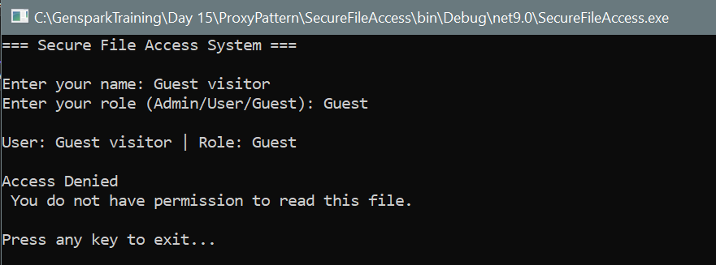

# Secure File Access System using Proxy Design Pattern

This application demonstrates the use of the **Proxy Design Pattern** to enforce **role-based access control** for reading sensitive files in a C# application.

## Overview

The system includes the following user roles:

- **Admin**: Full access to read file contents.
- **User**: Limited access (metadata only).
- **Guest**: No access to the file.

The **ProxyFile** class acts as a secure interface between the user and the sensitive file, delegating access based on the user's role.

---

## Design Pattern

**Pattern Used**: `Proxy Pattern`

- **Intent**: Provide a surrogate or placeholder for another object to control access to it.
- **Why**: To restrict file access using user roles without exposing the actual file object directly.

---

## Output:

