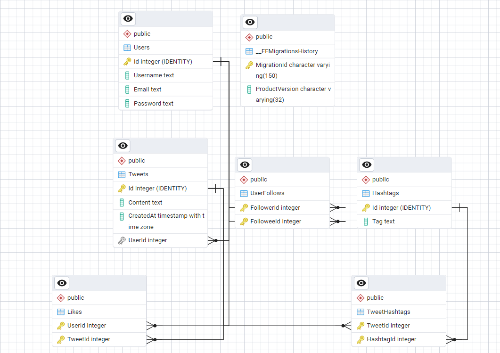

# Twitter-Like Backend API

A backend application built with **ASP.NET Core (.NET 8)**, **Entity Framework Core (EF Core)**, and **PostgreSQL** that mimics the core functionality of Twitter. It supports user registration, tweeting, liking tweets, using hashtags, and following users.

---

## Features

- User Registration
- Post Tweets
- Like Tweets
- Use Hashtags
- Follow/Unfollow Users
- Code-First Database Design with EF Core
- PostgreSQL Integration

---

## Technologies Used

- **.NET 8**
- **ASP.NET Core Web API**
- **Entity Framework Core**
- **PostgreSQL**
- **C#**
- **Swagger (OpenAPI)**

---

## Project Structure

TwitterApplication/
│
├── Models/
│ ├── User.cs
│ ├── Tweet.cs
│ ├── Like.cs
│ ├── Hashtag.cs
│ ├── TweetHashtag.cs
│ └── UserFollow.cs
│
├── Contexts/
│ └── TwitterContext.cs
│
├── Controllers/
│ └── (You can add API controllers here)
│
├── Program.cs
└── appsettings.json


---

## Database Schema Overview

### User
- `Id`: Primary Key
- `Username`, `Email`, `PasswordHash`
- Navigation: Tweets, Likes, Followers, Following

### Tweet
- `Id`: Primary Key
- `Content`, `CreatedAt`
- `UserId`: Foreign Key (User)
- Navigation: Likes, TweetHashtags

### Like
- Composite Key: `UserId + TweetId`
- Navigation: Tweet, User

### Hashtag
- `Id`: Primary Key
- `Tag`: Hashtag text
- Navigation: TweetHashtags

### TweetHashtag
- Composite Key: `TweetId + HashtagId`
- Many-to-Many between Tweet and Hashtag

### UserFollow
- Composite Key: `FollowerId + FolloweeId`
- Navigation: Followers, Following

---

## Running the Application

```
dotnet tool install --global dotnet-ef
```

### Nugets Packet manager

Microsoft.EntityFrameworkCore
Microsoft.EntityFrameworkCore.Design
Npgsql.entityframeworkcore.postgre


### Migration

```
dotnet ef migrations add init --project TwitterApplication --startup-project TwitterApplication
dotnet ef database update --project TwitterApplication --startup-project TwitterApplication
```

## PGAdmin




