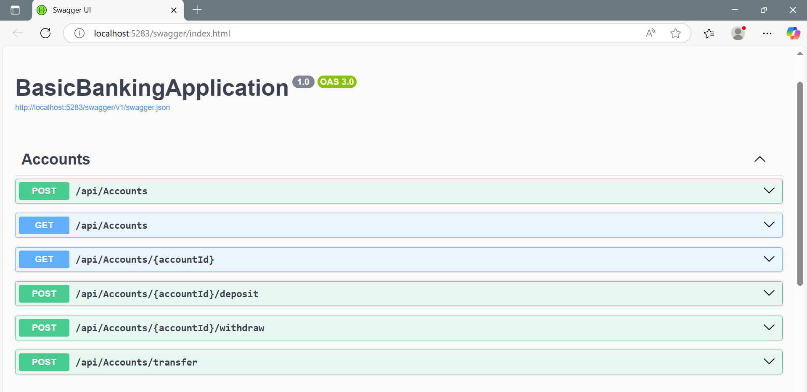
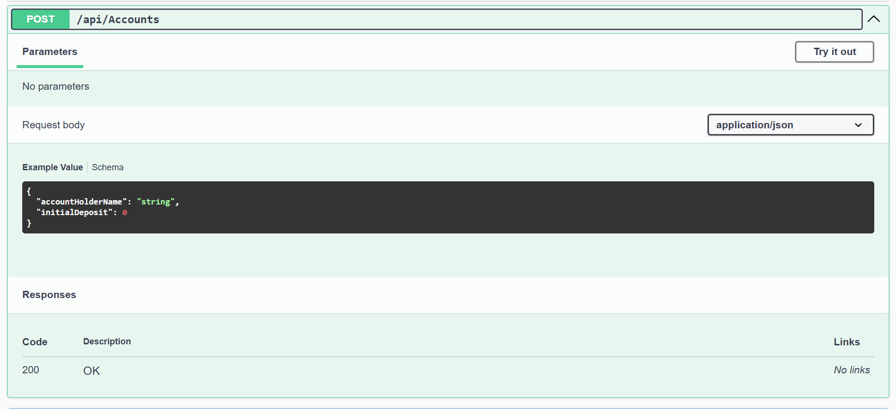
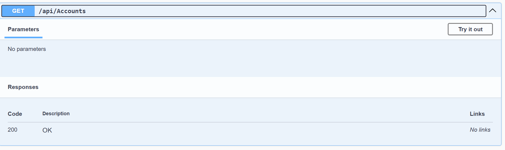
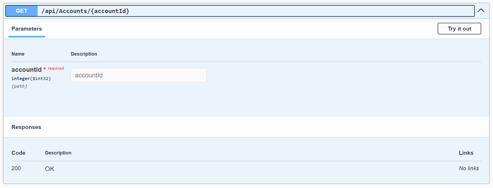
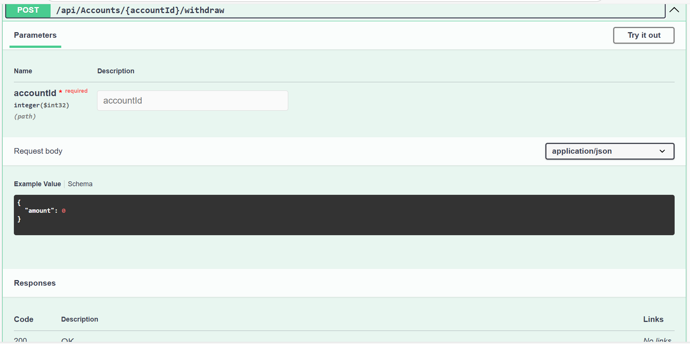
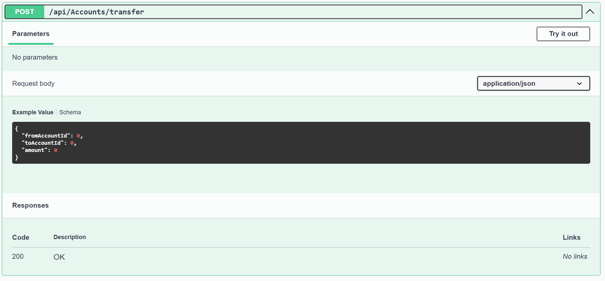

# BasicBankingApplication

A simple ASP.NET Core Web API for basic banking operations like creating accounts, depositing/withdrawing money, checking balances, and transferring funds between accounts. The application ensures data consistency using transaction rollbacks and includes proper input validation and exception handling.

---

##  Features

-  Create bank accounts with initial deposit
-  Deposit money into an account
-  Withdraw money from an account (maintaining ₹500 minimum balance)
-  Transfer money between accounts (with transaction rollback if failure occurs)
-  View account balance
-  Uses Entity Framework Core for data access
-  Transaction-safe operations with rollback support
-  Proper error handling and HTTP status codes

---

## Outputs

