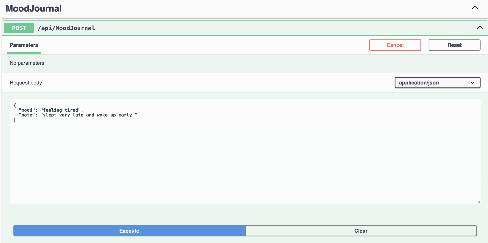
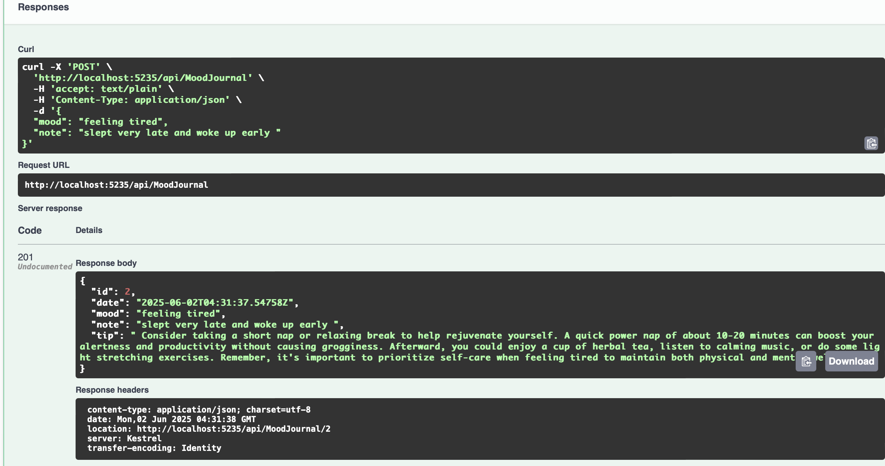
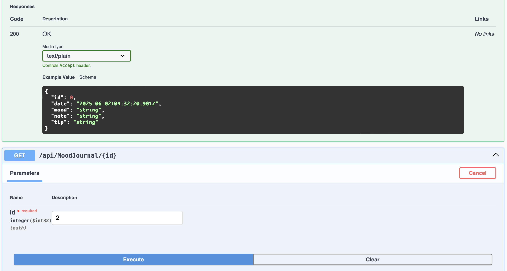
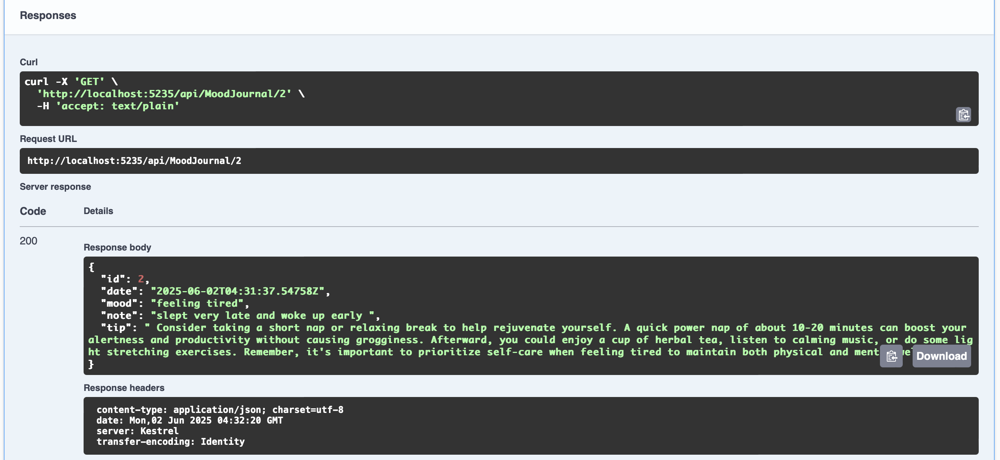
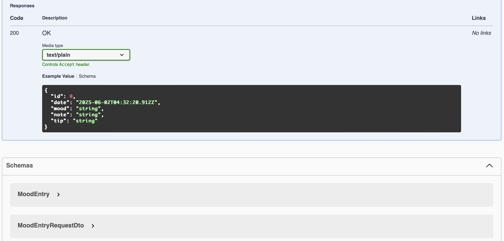

# MoodJournal API

Welcome to **MoodJournal**, a mood-tracking RESTful API built using ASP.NET Core and PostgreSQL. This application allows users to log daily moods with personal notes and receive AI-generated self-care tips based on their emotional state.

---

## Features

- Add mood entries with a short note.
- Auto-generates a positive self-care tip using an integrated LLM (e.g., Mistral via Ollama).
- Retrieve mood entries by ID.
- Built with modern, scalable technologies.

---

## Tech Stack

| Layer           | Technology                |
|----------------|---------------------------|
| Backend        | ASP.NET Core Web API      |
| ORM            | Entity Framework Core     |
| Database       | PostgreSQL                |
| AI Integration | LLM via Ollama (Mistral)  |
| API Tooling    | Swagger / OpenAPI         |

---

## Prerequisites

1. **.NET 7 or .NET 8 SDK**
2. **PostgreSQL** installed and running
3. **Ollama** installed and running the `mistral` model:
   - Download: https://ollama.com
   - Start the model: `ollama run mistral`

---

## Getting Started

###  Step 1: Clone the Repository

```bash
git clone https://github.com/yourusername/MoodJournal.git
cd MoodJournal
```

###  Step 2: Configure Database

Update your connection string in appsettings.json:

```
"ConnectionStrings": {
  "DefaultConnection": "User ID=postgres;Password=YOURPASSWORD;Host=localhost;Port=5432;Database=MoodJournalDb;"
}
```

Then run the following to create the database:

```
dotnet ef migrations add InitialCreate
dotnet ef database update
```

### Step 3: Configure LLM (Ollama)

Make sure you have the Mistral model running locally:

```
ollama run mistral
```

The default API runs at:

```
"LLMSettings": {
  "BaseUrl": "http://localhost:11434/api/generate"
}
```

## Output:











