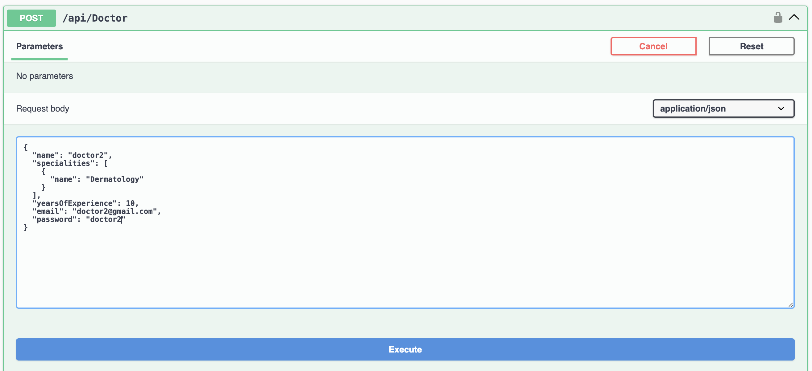

#  Doctor-Patient Appointment Management System

A RESTful web API built using ASP.NET Core and Entity Framework Core for managing doctors, patients, appointments functionalities in a clinic or hospital environment.

---

##  Features

-  **Doctor Management**
  - Add, update, delete doctors
  - Filter doctors by speciality
  - Doctors can view the following post authentication:
   1) GET: /api/Doctor
   2) GET: /api/Patient
   3) POST: /api/Authentication
   4) POST: /api/Doctor
   5) POST: /api/Patient

- 👩‍⚕️ **Patient Management**
  - Register and manage patient profiles
  - Secure authentication with JWT
  - Patientss can view the following post authentication:
   1) GET: /api/Doctor
   2) GET: /api/Patient
   3) GET: /api/Patient/{id}
   4) POST: /api/Authentication
   5) POST: /api/Doctor
   6) POST: /api/Patient

- **Appointments**
  - Book appointments between patients and doctors
  - View appointment history

- **Authentication & Authorization**
  - JWT-based secure login for doctors, patients, and admin
  - Role-based access control

- **Database**
  - PostgreSQL database with Entity Framework Core
  - Stored procedure support (e.g., filter doctors by speciality)

---

## Technologies Used

- ASP.NET Core Web API
- Entity Framework Core
- PostgreSQL
- JWT (JSON Web Tokens)
- Swagger UI
- LINQ, Asynchronous Programming

---

## Output

### Post Doctor

### Authenticate Doctor

- Copy the token and paste it in the lock icon

- Paste the token and authorize

- Paste the token and authorize GET: /api/Patient

- Paste the token and authorize GET: /api/Patient/{id}

### Post Patient

### Authorize Patient

- Paste the token and authorize GET: /api/Doctor

- Paste the token and authorize GET: /api/Patient

- Paste the token and authorize GET: /api/Patient/{id}

