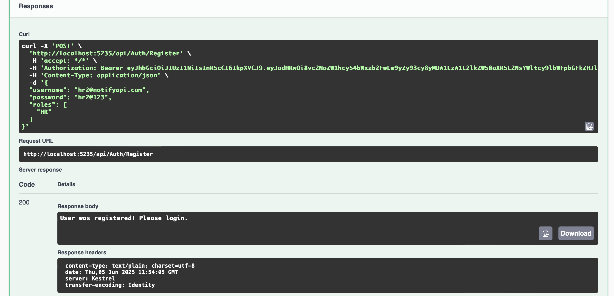

# NotifyAPI - Real-Time Document Notification System

NotifyAPI is an ASP.NET Core Web API application that allows HR users to upload documents and instantly notifies all connected staff users in real-time using SignalR.

---

## Features

- JWT-based authentication & authorization
- Secure document upload for HR role
- View document list for Staff role
- Real-time notifications to connected users via SignalR
- CORS configured for external frontend access
- PostgreSQL for persistent data storage
- Swagger UI for API testing

---

## Technologies Used

- ASP.NET Core Web API
- Entity Framework Core (PostgreSQL)
- SignalR
- JWT Authentication
- Identity & Roles
- Swagger
- HTML + JavaScript (for front-end demo)

---

## Output

- Register using POST: /api/Auth/Register

- Now login POST: /api/Auth

- Authorize

- POST /api/Documents/Upload as a HR

- Open Test.html and activate live server

- HR cannot use the GET /api/Documents

- Login as staff

- Copy The token and authorize as Staff

- Staff dont have permission to upload documents

