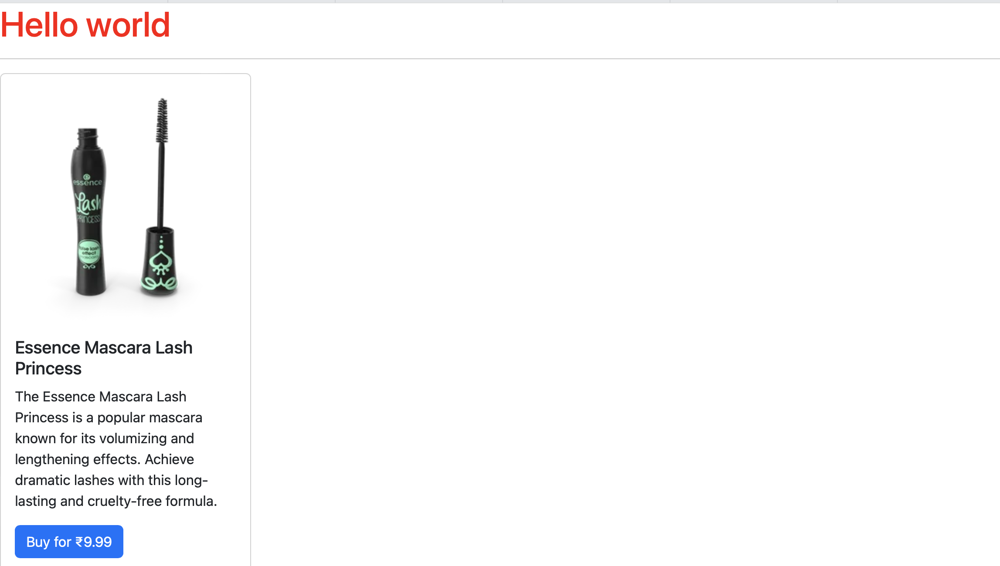

# MyApp

This project was generated using [Angular CLI](https://github.com/angular/angular-cli) version 20.0.1.

## Development server

To start a local development server, run:

```bash
ng serve
```

Once the server is running, open your browser and navigate to `http://localhost:4200/`. The application will automatically reload whenever you modify any of the source files.

## Code scaffolding

Angular CLI includes powerful code scaffolding tools. To generate a new component, run:

```bash
ng generate component component-name
```

For a complete list of available schematics (such as `components`, `directives`, or `pipes`), run:

```bash
ng generate --help
```

## Building

To build the project run:

```bash
ng build
```

This will compile your project and store the build artifacts in the `dist/` directory. By default, the production build optimizes your application for performance and speed.

## Running unit tests

To execute unit tests with the [Karma](https://karma-runner.github.io) test runner, use the following command:

```bash
ng test
```

## Running end-to-end tests

For end-to-end (e2e) testing, run:

```bash
ng e2e
```

Angular CLI does not come with an end-to-end testing framework by default. You can choose one that suits your needs.

## Additional Resources

For more information on using the Angular CLI, including detailed command references, visit the [Angular CLI Overview and Command Reference](https://angular.dev/tools/cli) page.


# Output




## Parent-Child Route


## Profile component


## Template Driven Validation : Use of ngModel for alert messages

login.html
```
<div class="loginDiv">
    <label class="form-control">Username</label>
    <input class="form-control" type="text" required [(ngModel)]="user.username" #un="ngModel"/>
    @if(un.control.touched && un.control.errors)
    {
        <span class="alert alert-danger">Username cannot be empty</span>
    }
     <label class="form-control">Password</label>
    <input class="form-control" type="text" required [(ngModel)]="user.password" #pass="ngModel"/>
     @if(pass.control.touched && pass.control.errors)
    {
        <span class="alert alert-danger">Psssword cannot be empty</span>
    }
    <button class="btn btn-success" (click)="handleLogin(un,pass)">Login</button>
</div>
```

login.ts
```
@Component({
  selector: 'app-login',
  imports: [FormsModule],
  templateUrl: './login.html',
  styleUrl: './login.css'
})
export class Login {
user:UserLoginModel = new UserLoginModel();
constructor(private userService:UserService,private route:Router){

}
handleLogin(un:any,pass:any){
  console.log(un.control.touched)
  if(un.control.errors || pass.control.errors)
    return;

  this.userService.validateUserLogin(this.user);
  this.route.navigateByUrl("/home/"+this.user.username);
}
}
```


## Reactive Form Validation

login.ts
```
@Component({
  selector: 'app-login',
  imports: [FormsModule,ReactiveFormsModule],
  templateUrl: './login.html',
  styleUrl: './login.css'
})

export class Login {
  user:UserLoginModel = new UserLoginModel();
  loginForm : FormGroup;

  constructor(private _userService:userService, private route:Router){
    this.loginForm = new FormGroup({
    un:new FormControl(null,Validators.required),
    pass:new FormControl(null,[Validators.required])
  })
  }

  public get un() : any {
    return this.loginForm.get("un")
  }

  public get pass() : any {
    return this.loginForm.get("pass")
  }

  handleLogin(){
    if(this.loginForm.invalid)
      return;
    this._userService.validateUserLogin(this.user);
    this.route.navigateByUrl("/home/"+this.user.username);
  }
}
```

login.html
```
<form [formGroup]="loginForm" class="loginDiv" (ngSubmit)="handleLogin()">
    <label class="form-control">Username</label>
    <input class="form-control" type="text" formControlName="un" />
    @if(un.touched && un.errors)
    {
        <span class="alert alert-danger">Username cannot be empty</span>
    }
     <label class="form-control">Password</label>
    <input class="form-control" type="text" formControlName="pass" />
     @if(pass.touched && pass.errors)
    {
        @if (pass.errors?.required) {
            <span class="alert alert-danger">Psssword cannot be empty</span>
        }
        @if (pass.errors?.lenError) {
            <span class="alert alert-danger">Psssword cannot be less than 5 chars</span>
        }

    }
    <button class="btn btn-success" [disabled]="loginForm.invalid" >Login</button>
</form>
```


## Custom Validation Errors

TextValidator.ts
```
import { AbstractControl, ValidationErrors, ValidatorFn } from "@angular/forms";

export function textValidator():ValidatorFn
{
    return (control: AbstractControl) : ValidationErrors | null => {
        const value = control.value;
        if(value?.length < 6)
        {
            return {lenError : 'Password is of wrong length'}
        }
        return null;
    }
}
```

login.html
```
<form [formGroup]="loginForm" class="loginDiv" (ngSubmit)="handleLogin()" >
    <label class="form-control">Username</label>
    <input class="form-control" type="text" formControlName="un"/>
    @if(un.touched && un.errors)
    {
        <span class="alert alert-danger">Username cannot be empty</span>
    }
     <label class="form-control">Password</label>
    <input class="form-control" type="text" formControlName="pass"/>
    @if(pass.touched && pass.errors)
    {
        @if (pass.errors?.required) {
            <span class="alert alert-danger">Psssword cannot be empty</span>
        }
        @if (pass.errors?.lenError) {
            <span class="alert alert-danger">Psssword cannot be less than 5 chars</span>
        }
    }
    <button class="btn btn-success" [disabled]="loginForm.invalid">Login</button>
</form>
```

login.ts
```
constructor(private _userService:userService, private route:Router){
    this.loginForm = new FormGroup({
    un:new FormControl(null,Validators.required),
    pass:new FormControl(null,[Validators.required,textValidator()])
  })
  }
```


