# MyApp

This project was generated using [Angular CLI](https://github.com/angular/angular-cli) version 20.0.1.

## Development server

To start a local development server, run:

```bash
ng serve
```

Once the server is running, open your browser and navigate to `http://localhost:4200/`. The application will automatically reload whenever you modify any of the source files.

## Code scaffolding

Angular CLI includes powerful code scaffolding tools. To generate a new component, run:

```bash
ng generate component component-name
```

For a complete list of available schematics (such as `components`, `directives`, or `pipes`), run:

```bash
ng generate --help
```

## Building

To build the project run:

```bash
ng build
```

This will compile your project and store the build artifacts in the `dist/` directory. By default, the production build optimizes your application for performance and speed.

## Running unit tests

To execute unit tests with the [Karma](https://karma-runner.github.io) test runner, use the following command:

```bash
ng test
```

## Running end-to-end tests

For end-to-end (e2e) testing, run:

```bash
ng e2e
```

Angular CLI does not come with an end-to-end testing framework by default. You can choose one that suits your needs.

## Additional Resources

For more information on using the Angular CLI, including detailed command references, visit the [Angular CLI Overview and Command Reference](https://angular.dev/tools/cli) page.


# Output

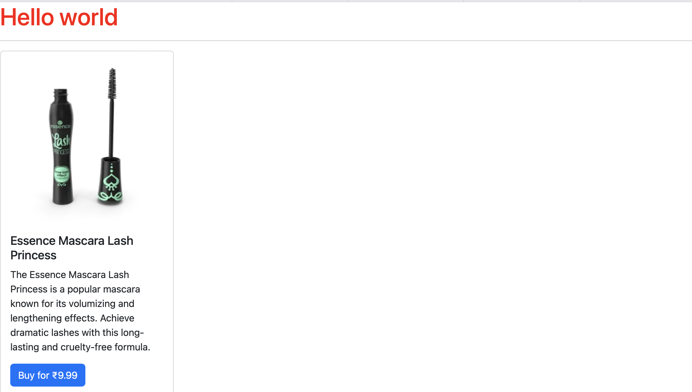


## Parent-Child Route

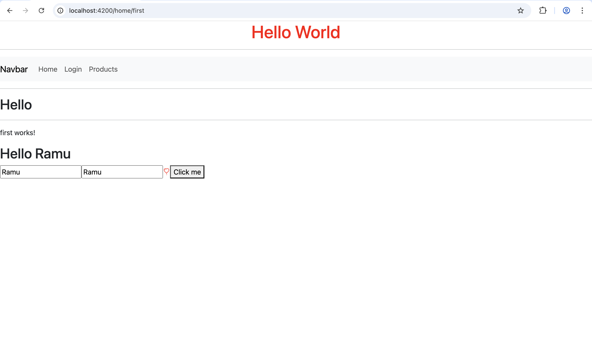

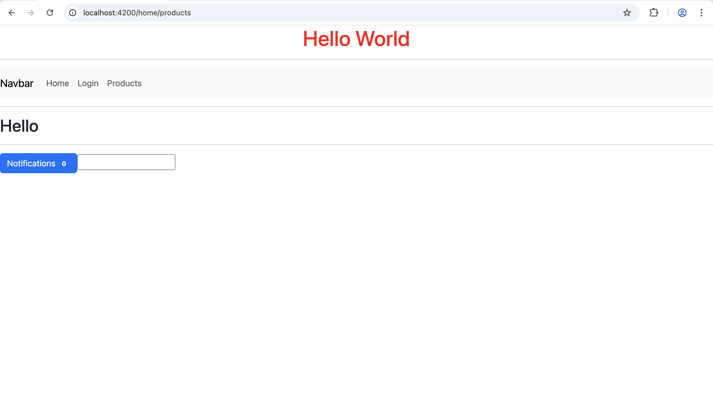

## Profile component

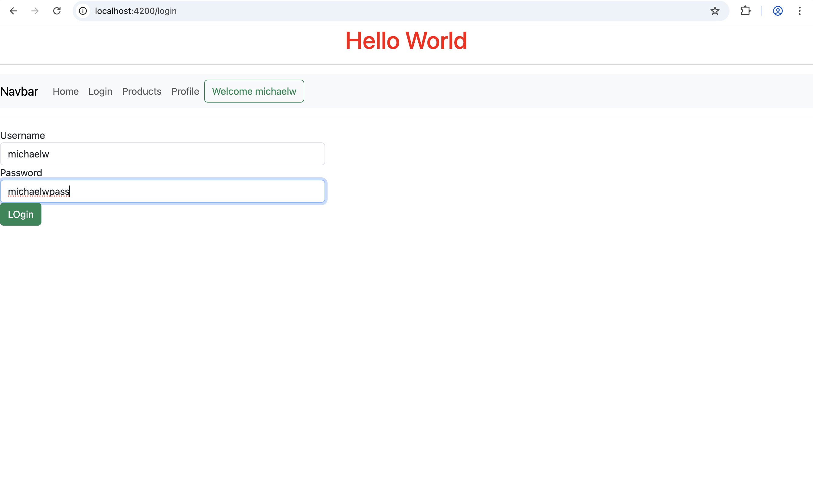

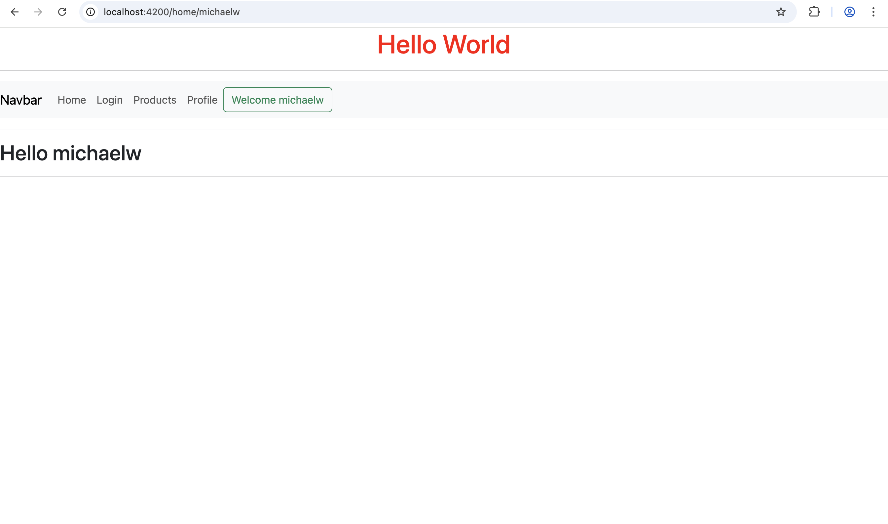

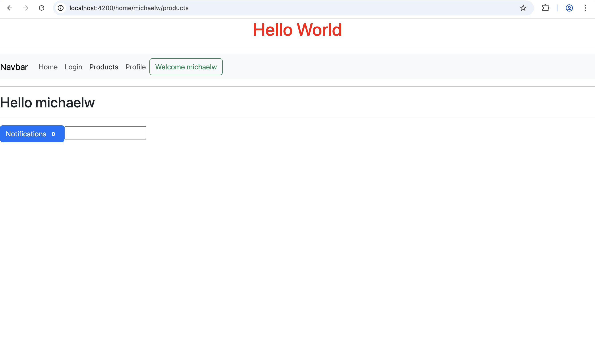

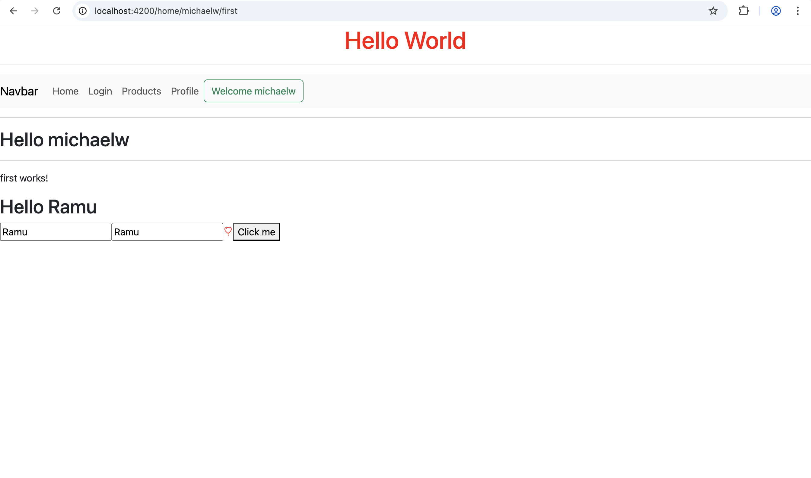

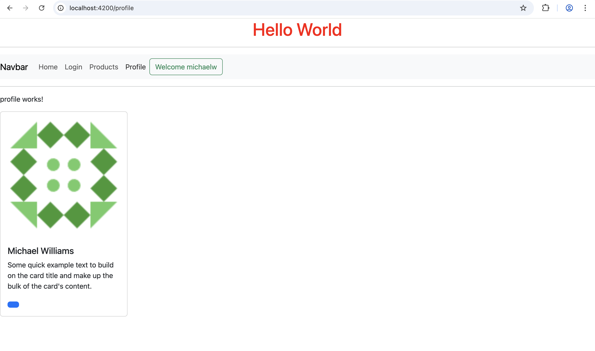

## Template Driven Validation : Use of ngModel for alert messages

login.html
```
<div class="loginDiv">
    <label class="form-control">Username</label>
    <input class="form-control" type="text" required [(ngModel)]="user.username" #un="ngModel"/>
    @if(un.control.touched && un.control.errors)
    {
        <span class="alert alert-danger">Username cannot be empty</span>
    }
     <label class="form-control">Password</label>
    <input class="form-control" type="text" required [(ngModel)]="user.password" #pass="ngModel"/>
     @if(pass.control.touched && pass.control.errors)
    {
        <span class="alert alert-danger">Psssword cannot be empty</span>
    }
    <button class="btn btn-success" (click)="handleLogin(un,pass)">Login</button>
</div>
```

login.ts
```
@Component({
  selector: 'app-login',
  imports: [FormsModule],
  templateUrl: './login.html',
  styleUrl: './login.css'
})
export class Login {
user:UserLoginModel = new UserLoginModel();
constructor(private userService:UserService,private route:Router){

}
handleLogin(un:any,pass:any){
  console.log(un.control.touched)
  if(un.control.errors || pass.control.errors)
    return;

  this.userService.validateUserLogin(this.user);
  this.route.navigateByUrl("/home/"+this.user.username);
}
}
```

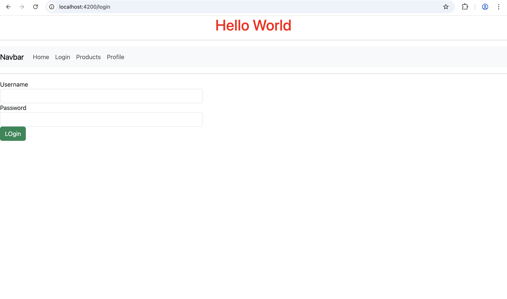

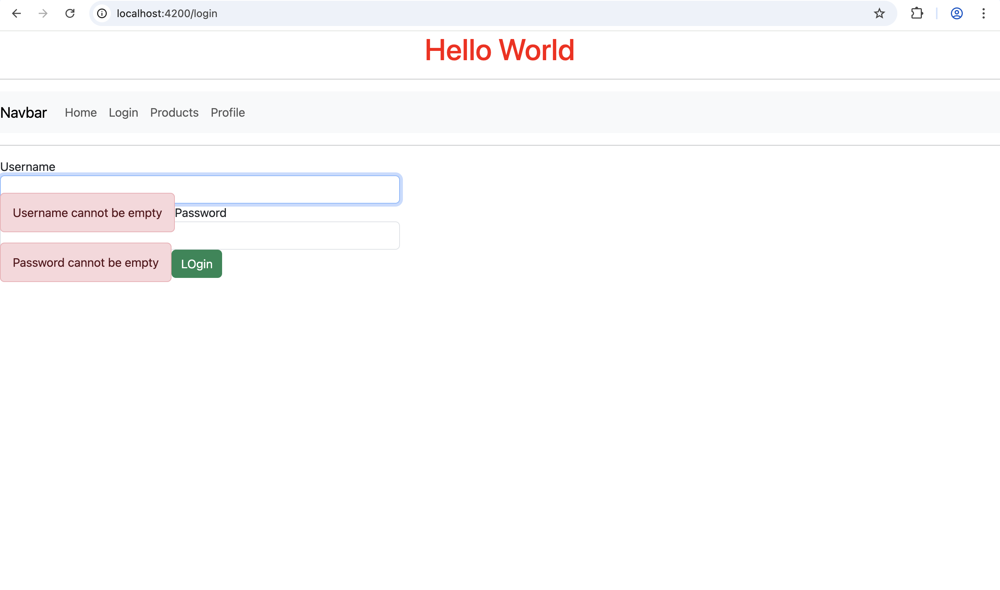

## Reactive Form Validation

login.ts
```
@Component({
  selector: 'app-login',
  imports: [FormsModule,ReactiveFormsModule],
  templateUrl: './login.html',
  styleUrl: './login.css'
})

export class Login {
  user:UserLoginModel = new UserLoginModel();
  loginForm : FormGroup;

  constructor(private _userService:userService, private route:Router){
    this.loginForm = new FormGroup({
    un:new FormControl(null,Validators.required),
    pass:new FormControl(null,[Validators.required])
  })
  }

  public get un() : any {
    return this.loginForm.get("un")
  }

  public get pass() : any {
    return this.loginForm.get("pass")
  }

  handleLogin(){
    if(this.loginForm.invalid)
      return;
    this._userService.validateUserLogin(this.user);
    this.route.navigateByUrl("/home/"+this.user.username);
  }
}
```

login.html
```
<form [formGroup]="loginForm" class="loginDiv" (ngSubmit)="handleLogin()">
    <label class="form-control">Username</label>
    <input class="form-control" type="text" formControlName="un" />
    @if(un.touched && un.errors)
    {
        <span class="alert alert-danger">Username cannot be empty</span>
    }
     <label class="form-control">Password</label>
    <input class="form-control" type="text" formControlName="pass" />
     @if(pass.touched && pass.errors)
    {
        @if (pass.errors?.required) {
            <span class="alert alert-danger">Psssword cannot be empty</span>
        }
        @if (pass.errors?.lenError) {
            <span class="alert alert-danger">Psssword cannot be less than 5 chars</span>
        }

    }
    <button class="btn btn-success" [disabled]="loginForm.invalid" >Login</button>
</form>
```

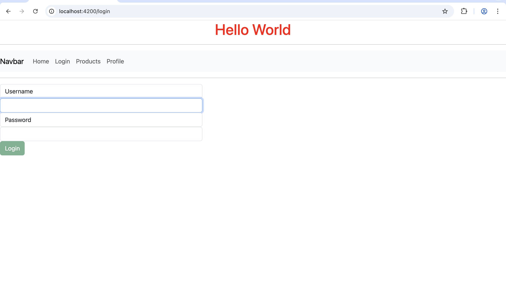

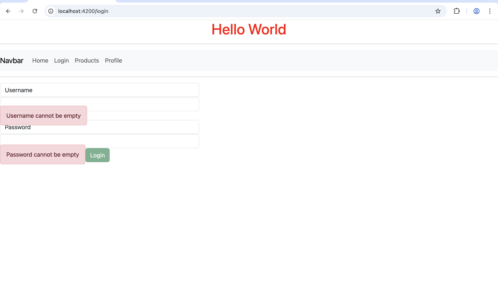

## Custom Validation Errors

TextValidator.ts
```
import { AbstractControl, ValidationErrors, ValidatorFn } from "@angular/forms";

export function textValidator():ValidatorFn
{
    return (control: AbstractControl) : ValidationErrors | null => {
        const value = control.value;
        if(value?.length < 6)
        {
            return {lenError : 'Password is of wrong length'}
        }
        return null;
    }
}
```

login.html
```
<form [formGroup]="loginForm" class="loginDiv" (ngSubmit)="handleLogin()" >
    <label class="form-control">Username</label>
    <input class="form-control" type="text" formControlName="un"/>
    @if(un.touched && un.errors)
    {
        <span class="alert alert-danger">Username cannot be empty</span>
    }
     <label class="form-control">Password</label>
    <input class="form-control" type="text" formControlName="pass"/>
    @if(pass.touched && pass.errors)
    {
        @if (pass.errors?.required) {
            <span class="alert alert-danger">Psssword cannot be empty</span>
        }
        @if (pass.errors?.lenError) {
            <span class="alert alert-danger">Psssword cannot be less than 5 chars</span>
        }
    }
    <button class="btn btn-success" [disabled]="loginForm.invalid">Login</button>
</form>
```

login.ts
```
constructor(private _userService:userService, private route:Router){
    this.loginForm = new FormGroup({
    un:new FormControl(null,Validators.required),
    pass:new FormControl(null,[Validators.required,textValidator()])
  })
  }
```

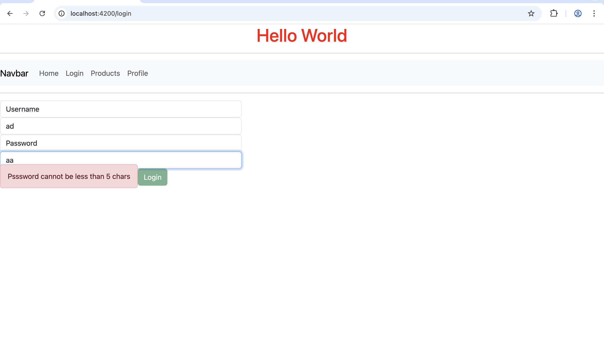

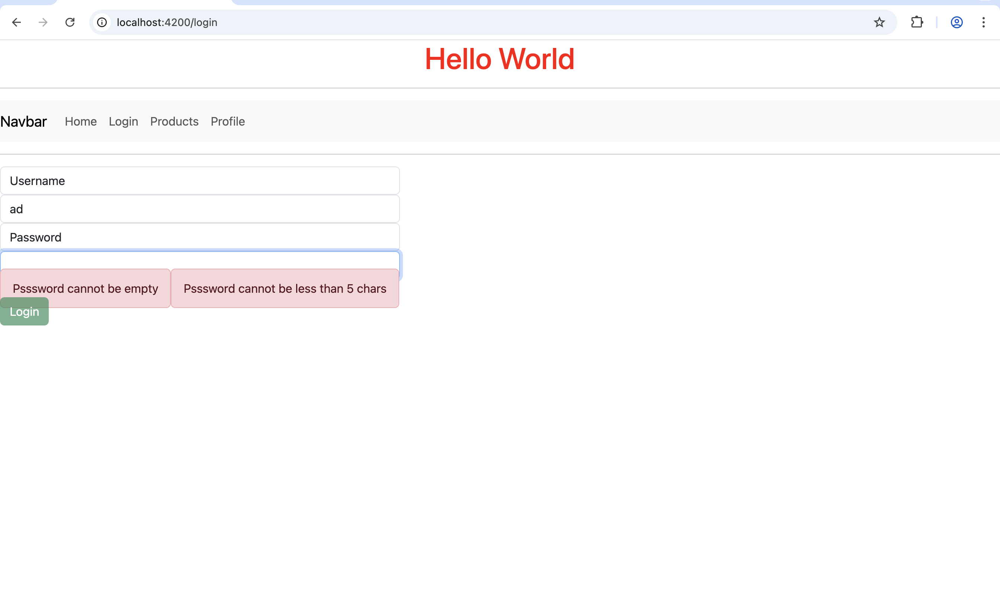


## Ngrx/store

User.ts
```
export class User {
    constructor(
        public id : number = 0,
        public username : string = "",
        public email : string = "",
        public role : string = ""
    )
    {

    }
}
```

UserState.ts
```
import { error } from "console";
import { User } from "../models/User";

export interface UserState{
    users : User[];
    loading : boolean;
    error : string | null;
}

export const initialUserState : UserState = {
    users : [],
    loading : false,
    error : null
};
```

user.selector.ts
```
import { createFeatureSelector, createSelector } from "@ngrx/store";
import { UserState } from "./UserState";

export const selectUserState = createFeatureSelector<UserState>('user');

export const selectAllUsers = createSelector(selectUserState, state => state.users);
export const selectUserLoading = createSelector(selectUserState, state => state.loading);
export const selectUserError = createSelector(selectUserState, state => state.error);
```

user.actions.ts
```
import { createAction, props } from "@ngrx/store";
import { User } from "../models/User";

export const loadUsers = createAction('[Users] Load Users');
export const loadUsersSuccess = createAction('[Users] Load Users Success',props<{users : User[]}>());
export const addUser = createAction('[Users] Add User',props<{user : User}>());
export const loadUsersFailure = createAction('[Users] Load Users Failure',props<{error : string}>());
```

user.reducer.ts
```
import { createReducer, on } from "@ngrx/store";
import { initialUserState } from "./UserState";
import * as UserActions from "./users.actions";

export const userReducer = createReducer(initialUserState,
    on(UserActions.loadUsers, state => ({...state, loading : true, error : null})),
    on(UserActions.loadUsersSuccess, (state, {users}) => ({...state, users, loading : false, error : null})),
    on(UserActions.loadUsersFailure, (state, {error}) => ({...state, loading : false, error})),
    on(UserActions.addUser, (state, {user}) => ({...state, users : [...state.users, user], loading : false, error: null}))
)
```

app.config.ts
```
import { ApplicationConfig, provideBrowserGlobalErrorListeners, provideZoneChangeDetection } from '@angular/core';
import { provideRouter } from '@angular/router';

import { routes } from './app.routes';
import { provideClientHydration, withEventReplay } from '@angular/platform-browser';
import { provideHttpClient } from '@angular/common/http';
import { ProductService } from './services/product.service';
import { userService } from './services/userService';
import { AuthGuard } from './auth-guard';
import { provideState, provideStore } from '@ngrx/store';
import { userReducer } from './ngrx/user.reducer';

export const appConfig: ApplicationConfig = {
  providers: [
    provideBrowserGlobalErrorListeners(),
    provideZoneChangeDetection({ eventCoalescing: true }),
    provideRouter(routes), provideClientHydration(withEventReplay()),
    provideHttpClient(),
    ProductService,
    userService,
    AuthGuard,
    provideStore(),
    provideState('user',userReducer)
  ]
};
```

add-user component:
add-user.html
```
<p>add-user works!</p>
<button (click)="handleAddUser()">Add User</button>
```

add-user.ts
```
import { Component } from '@angular/core';
import { Store } from '@ngrx/store';
import { User } from '../models/User';
import { addUser } from '../ngrx/users.actions';

@Component({
  selector: 'app-add-user',
  imports: [],
  templateUrl: './add-user.html',
  styleUrl: './add-user.css'
})
export class AddUser {
  constructor(private store : Store)
  {

  }

  handleAddUser()
  {
    const newUser = new User(102,'Doe','doe@gmail.com','user');
    this.store.dispatch(addUser({user : newUser}));
  }
}
```

user-list component
user-list.ts
```
import { Component, OnInit } from '@angular/core';
import { Observable } from 'rxjs';
import { User } from '../models/User';
import { Store } from '@ngrx/store';
import { selectAllUsers, selectUserError, selectUserLoading } from '../ngrx/user.selector';
import { AddUser } from "../add-user/add-user";
import { AsyncPipe, NgFor, NgIf } from '@angular/common';

@Component({
  selector: 'app-user-list',
  imports: [AddUser,NgIf,NgFor,AsyncPipe],
  templateUrl: './user-list.html',
  styleUrl: './user-list.css'
})
export class UserList implements OnInit{

  users$ : Observable<User[]>;
  loading$ : Observable<boolean>;
  error$ : Observable<string | null>;

  constructor(private store: Store)
  {
    this.users$ = this.store.select(selectAllUsers);
    this.loading$ = this.store.select(selectUserLoading);
    this.error$ = this.store.select(selectUserError);
  }

  ngOnInit(): void {
    this.store.dispatch({type : '[Users] Load Users'});
  }

}
```

user-list.html
```
<app-add-user></app-add-user>
<p>user-list works!</p>
<hr/>
<div *ngIf=""loading$ | async>Loading Data</div>
<div *ngIf="!(loading$ | async)">
  <ul>
    <li *ngFor="let user of users$ | async">
      {{ user.username }}
    </li>
  </ul>
  ```

app.routes.ts
```
import { Routes } from '@angular/router';
import { First } from './first/first';
import { Login } from './login/login';
import { Products } from './products/products';
import { Home } from './home/home';
import { Profile } from './profile/profile';
import { AuthGuard } from './auth-guard';
import { UserList } from './user-list/user-list';

export const routes: Routes = [
    {path:'landing',component:First},
    {path:'login',component:Login},
    {path:'products',component:Products},
    {path:'home/:un',component:Home, children :
        [
            {path:'products',component:Products},
            {path:'first',component:First}
        ]
    },
    {path:'profile',component:Profile,canActivate:[AuthGuard]},
    {path:'users',component:UserList}
];
```

menu.html
```
<nav class="navbar navbar-expand-lg navbar-light bg-light">
  <a class="navbar-brand" href="#">Navbar</a>
  <button class="navbar-toggler" type="button" data-toggle="collapse" data-target="#navbarSupportedContent" aria-controls="navbarSupportedContent" aria-expanded="false" aria-label="Toggle navigation">
    <span class="navbar-toggler-icon"></span>
  </button>

  <div class="collapse navbar-collapse" id="navbarSupportedContent">
    <ul class="navbar-nav mr-auto">
      <li class="nav-item active">
        <a class="nav-link" [routerLink]="['home',usrname,'first']">Home</a>
      </li>
      <li class="nav-item">
        <a class="nav-link" routerLink="login">Login</a>
      </li>
     
      <li class="nav-item">
        <a class="nav-link" [routerLink]="['home',usrname,'products']">Products</a>
      </li>
      <li class="nav-item">
        <a class="nav-link" routerLink="profile">Profile</a>
      </li>
      <li class="nav-item">
        <a class="nav-link" routerLink="users">Users</a>
      </li>
    </ul>
    <form class="form-inline my-2 my-lg-0">
      @if(usrname!= null)
      {
        <button class="btn btn-outline-success my-2 my-sm-0" type="submit">Welcome {{usrname}} </button>
      }
         

     
    </form>
  </div>
</nav>
```

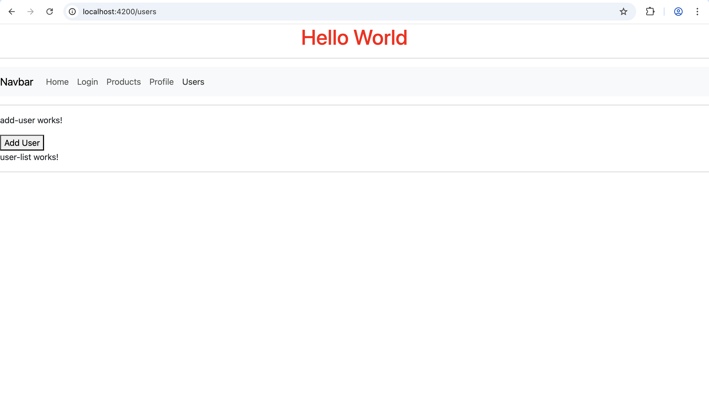

Click on AddUser button

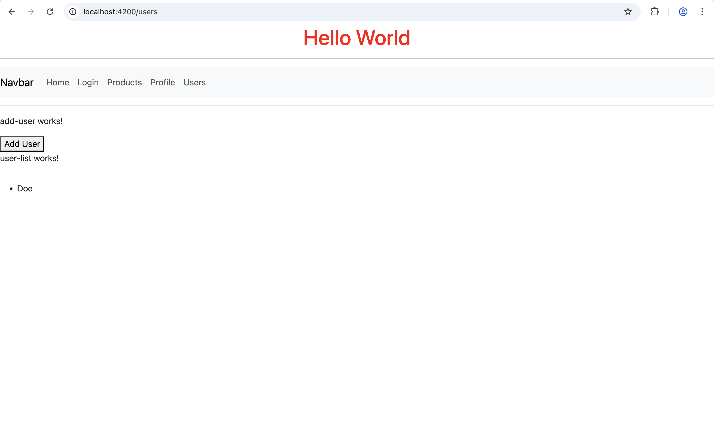
