## Dockerizing an Application

## 1. Simple Dcoker App

### index.html

```
<!DOCTYPE html>
<html lang="en">
<head>
    <meta charset="UTF-8">
    <meta name="viewport" content="width=device-width, initial-scale=1.0">
    <title>Document</title>
</head>
<body>
    Testing Simple Node App from Docker
</body>
</html>
```

### server.js

```
const http = require('http');
const fs = require('fs');
const path = require('path');

const hostname = '0.0.0.0';
const port = 3000;

const server = http.createServer((req, res) => {
  const filePath = path.join(__dirname, 'index.html');
  fs.readFile(filePath, (err, content) => {
    if (err) {
      res.writeHead(500);
      res.end('Error loading file');
    } else {
      res.writeHead(200, {'Content-Type': 'text/html'});
      res.end(content);
    }
  });
});

server.listen(port, hostname, () => {
  console.log(`Server running at http://${hostname}:${port}/`);
});
```

### Dockerfile

```
#My first docker build


#using debian as our base
FROM debian:bullseye


WORKDIR /app


#installing node
RUN apt-get update &&\
    apt-get install -y curl &&\
    curl -fsSL https://deb.nodesource.com/setup_22.x | bash - &&\
    apt-get install -y nodejs


#Copying the required files
COPY . . 


EXPOSE 3000

CMD ["node" ,"server.js"]
```

### Run the following in cmd

```
docker build -t simple-node-app .
```

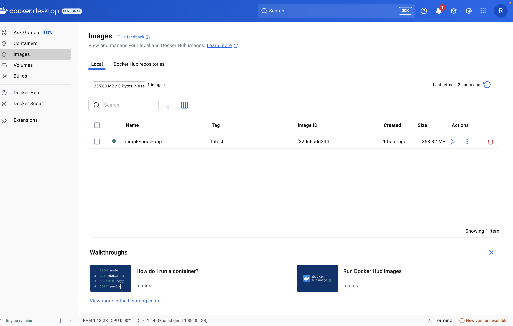

Note: 
t - tag name
. - search Dockerfile in current directory 


The following command will make the image to run by creating container

```
docker run -d -p 3000:3000 simple-node-app
```

—name will be used to set the name of the conatiner

```
docker run -d --name MyContainerName -p 3000:3000 simple-node-app
```


Then visit:

http://localhost:3000/


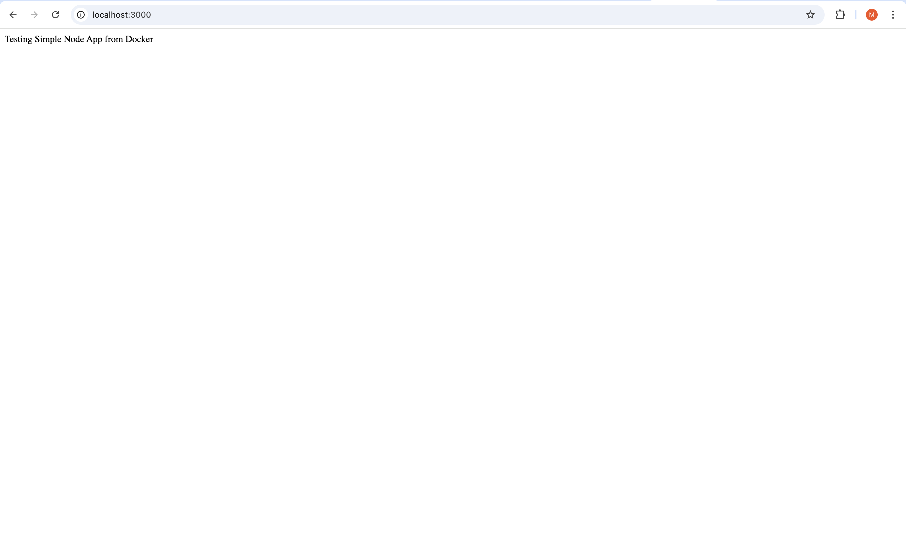


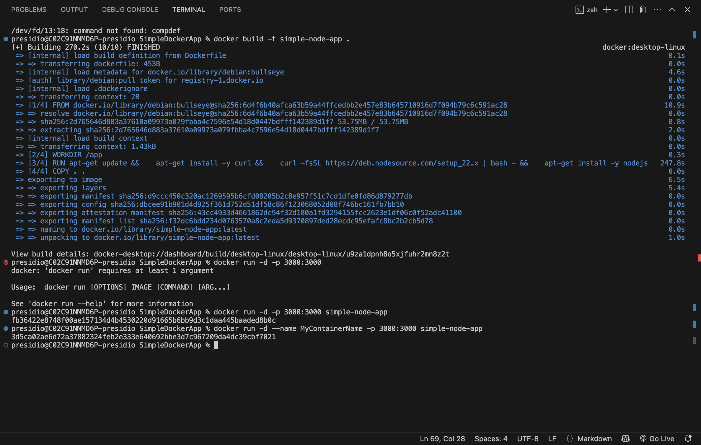


## Docker Volumes

## 2. NodeMonitoringDockerVolume

### index.js

```
console.log("Hello World");
```

### Run in cmd

```
npm init
```

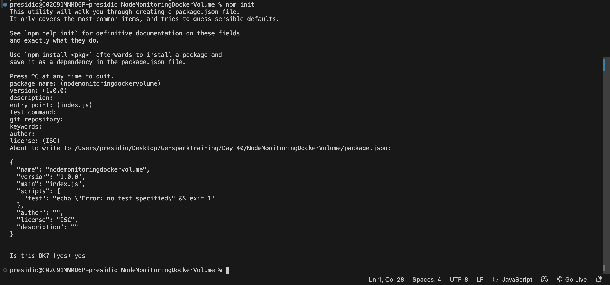

### package.json

```
{
  "name": "nodemon-docker-example",
  "version": "1.0.0",
  "main": "index.js",
  "scripts": {
    "test": "echo \"Error: no test specified\" && exit 1",
    "start":"nodemon index.js"
  },
  "author": "",
  "license": "ISC",
  "description": "",
  "devDependencies": {
    "nodemon":"^3.0.0"
  }
}
```

### Dockerfile

```
FROM node:22

WORKDIR /app

COPY package.json .

RUN  npm install

RUN npm install -g  nodemon

COPY . .

EXPOSE 3000

CMD ["npm", "start"]
```

### .dockerignore

node_modules
npm-debug.log

### In terminal run

```
docker build -t nodemon-docker-example .
```

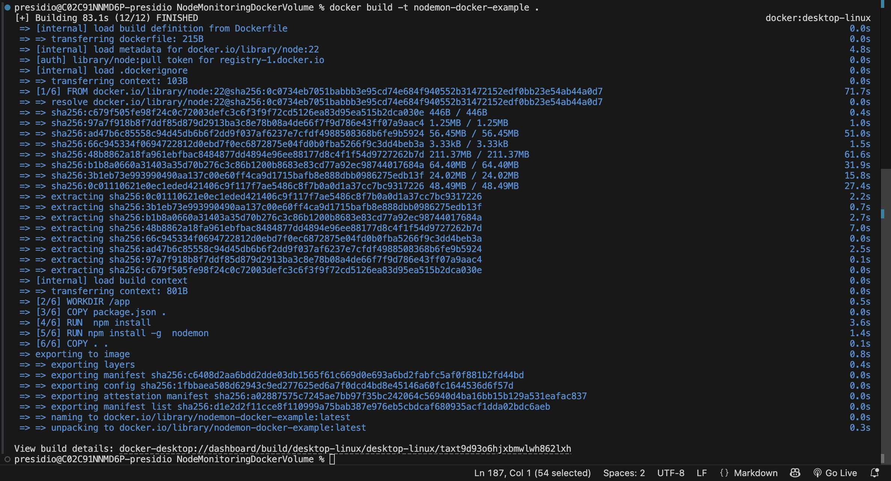

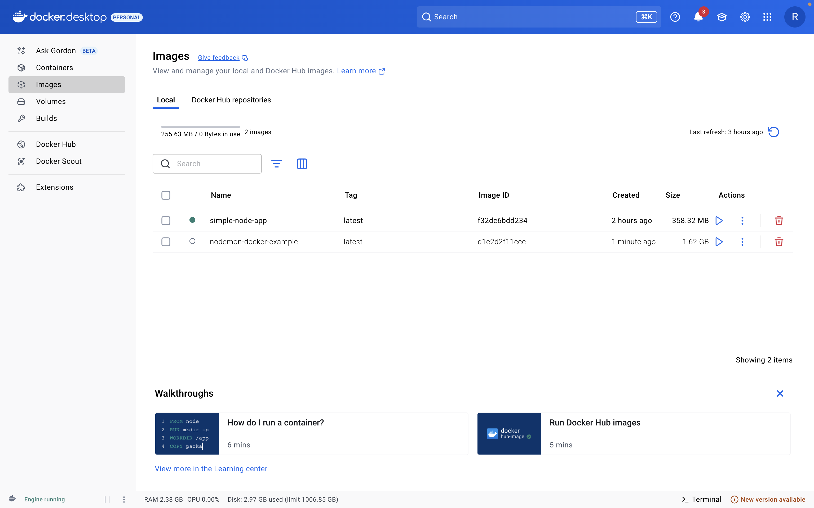

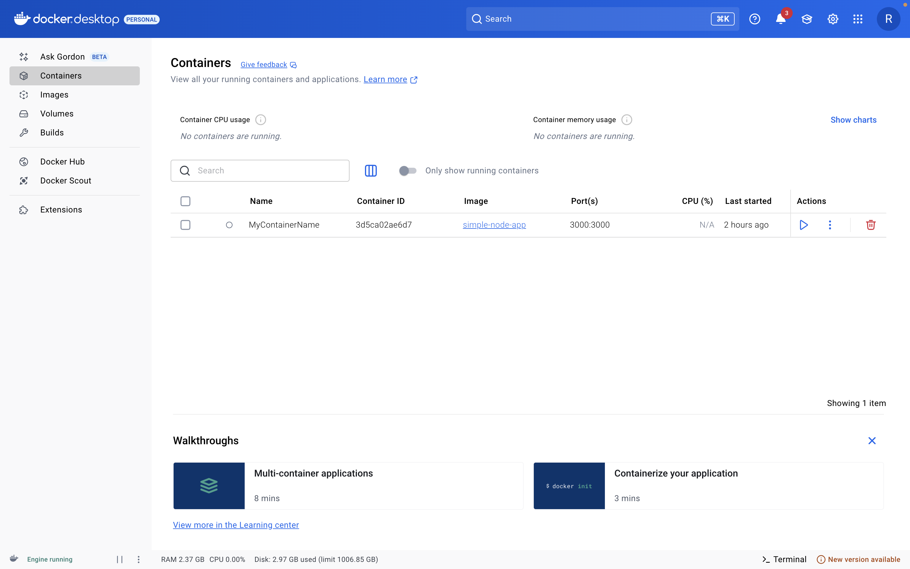

```
docker run  -it  -v ${PWD}:/app nodemon-docker-example
```

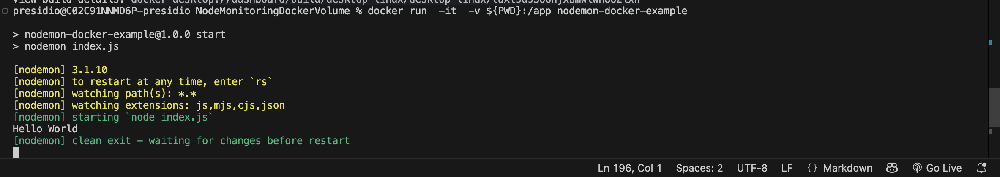

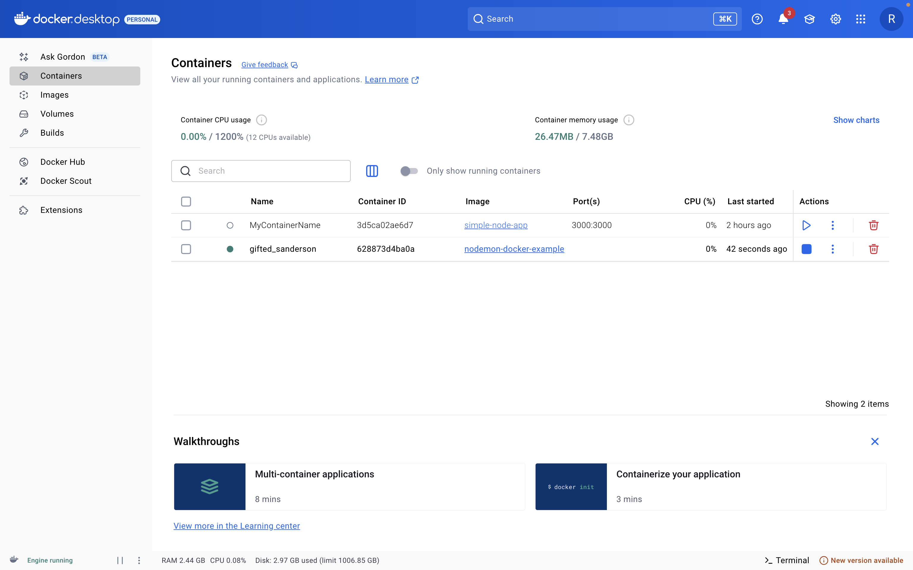

Now Modify the index.js and save

### index.js

```
console.log("Hello World - from Rohith");
```

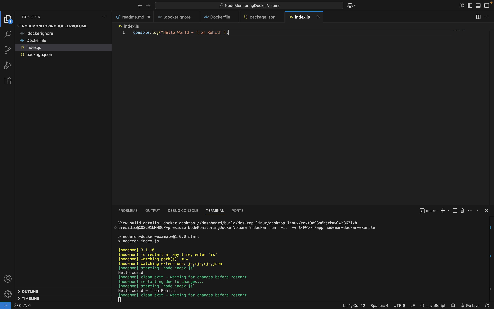


### Note:


rm: automatically remove containers before start executing
-it: for interactive pseudo output
-v: for volume mount


-v stands for --volume
It mounts a volume (a directory or file from your host machine) into the container’s filesystem.

- ${PWD}	= Current working directory on your host machine
- /app = Target directory inside the container
- -v = Tells Docker: "Mount this host directory into the container."

### -v ${PWD}:/app 

-  "Mount the current host directory into the container’s /app folder."
- This mounts your current directory on the host (${PWD}) into the /app folder inside the container.
- So the container can access your local project files.
- Useful for live development (e.g., with nodemon) — any changes you make on the host are reflected immediately in the container.


## 3. Running a Dotnet API in docker

### DoctorPatientAppointment

Create Dockerfile in the same directory as that of program.cs

## Dockerfile

```
# Use .NET 9.0 Preview SDK image (official preview tag)
FROM mcr.microsoft.com/dotnet/nightly/sdk:9.0 AS build
WORKDIR /App

# Copy everything
COPY . ./

# Restore as distinct layers
RUN dotnet restore

# Build and publish a release
RUN dotnet publish -c Release -o out

# Build runtime image
FROM mcr.microsoft.com/dotnet/nightly/aspnet:9.0
WORKDIR /App
COPY --from=build /App/out .

EXPOSE 8080
ENTRYPOINT ["dotnet", "DoctorPatientAppointment.dll"]
```

### Then run

```
docker build -t doctorpatientappointmentapi .
```
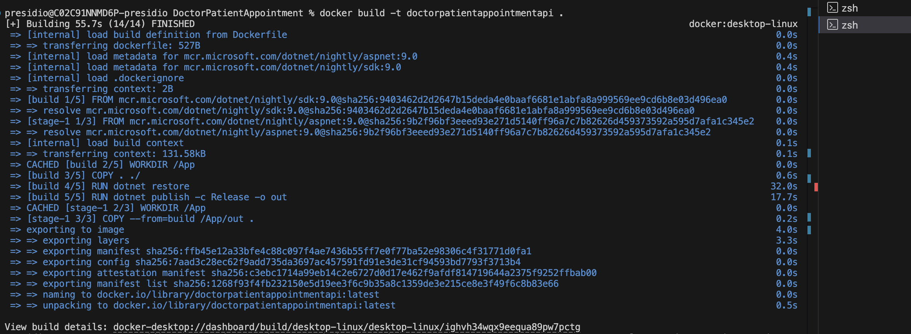


```
docker run -d -p 7234:8080 doctorpatientappointmentapi
```

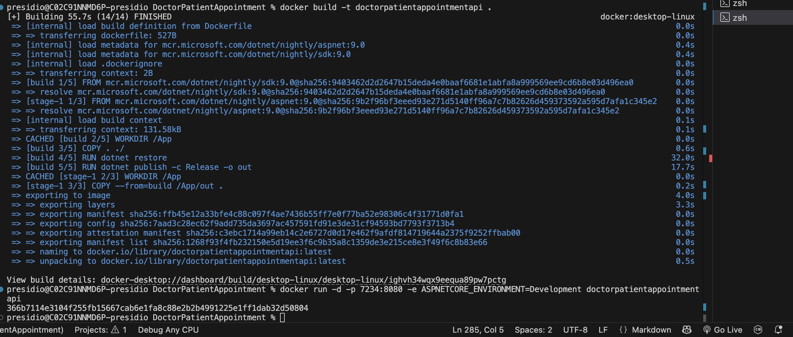


Now visit

http://localhost:7234/swagger/index.html

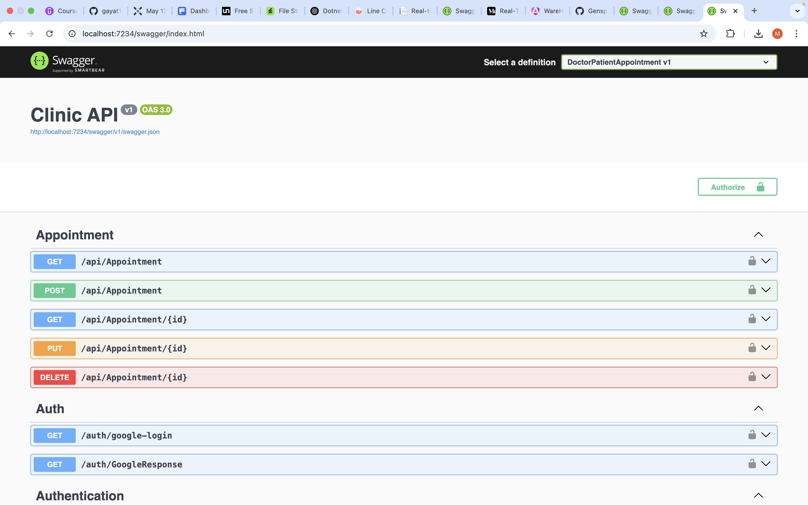


