## 1. Dockerizing Frontend Application

Run the backend

### angular.json

```
{
  "$schema": "./node_modules/@angular/cli/lib/config/schema.json",
  "version": 1,
  "newProjectRoot": "projects",
  "projects": {
    "WareHouseFileArchiverFrontend": {
      "projectType": "application",
      "schematics": {},
      "root": "",
      "sourceRoot": "src",
      "prefix": "app",
      "architect": {
        "build": {
          "builder": "@angular/build:application",
          "options": {
            "browser": "src/main.ts",
            "polyfills": [
              "zone.js"
            ],
            "tsConfig": "tsconfig.app.json",
            "assets": [
              {
                "glob": "**/*",
                "input": "public"
              }
            ],
            "styles": [
              "src/styles.css"
            ],
            "server": "src/main.server.ts",
            "outputMode": "server",
            "ssr": {
              "entry": "src/server.ts"
            }
          },
          "configurations": {
            "production": {
              "budgets": [
                {
                  "type": "initial",
                  "maximumWarning": "2MB",
                  "maximumError": "5MB"
                },
                {
                  "type": "anyComponentStyle",
                  "maximumWarning": "4kB",
                  "maximumError": "8kB"
                }
              ],
              "outputHashing": "all"
            },
            "development": {
              "optimization": false,
              "extractLicenses": false,
              "sourceMap": true
            }
          },
          "defaultConfiguration": "production"
        },
        "serve": {
          "builder": "@angular/build:dev-server",
          "configurations": {
            "production": {
              "buildTarget": "WareHouseFileArchiverFrontend:build:production"
            },
            "development": {
              "buildTarget": "WareHouseFileArchiverFrontend:build:development"
            }
          },
          "defaultConfiguration": "development"
        },
        "extract-i18n": {
          "builder": "@angular/build:extract-i18n"
        },
        "test": {
          "builder": "@angular/build:karma",
          "options": {
            "polyfills": [
              "zone.js",
              "zone.js/testing"
            ],
            "tsConfig": "tsconfig.spec.json",
            "assets": [
              {
                "glob": "**/*",
                "input": "public"
              }
            ],
            "styles": [
              "src/styles.css"
            ]
          }
        }
      }
    }
  }
}
```

Modify it by the following values
```
"budgets": [
            {
              "type": "initial",
              "maximumWarning": "2MB",
              "maximumError": "5MB"
            },
        ]
```

### In Terminal, run

```
ng build --configuration=production
```

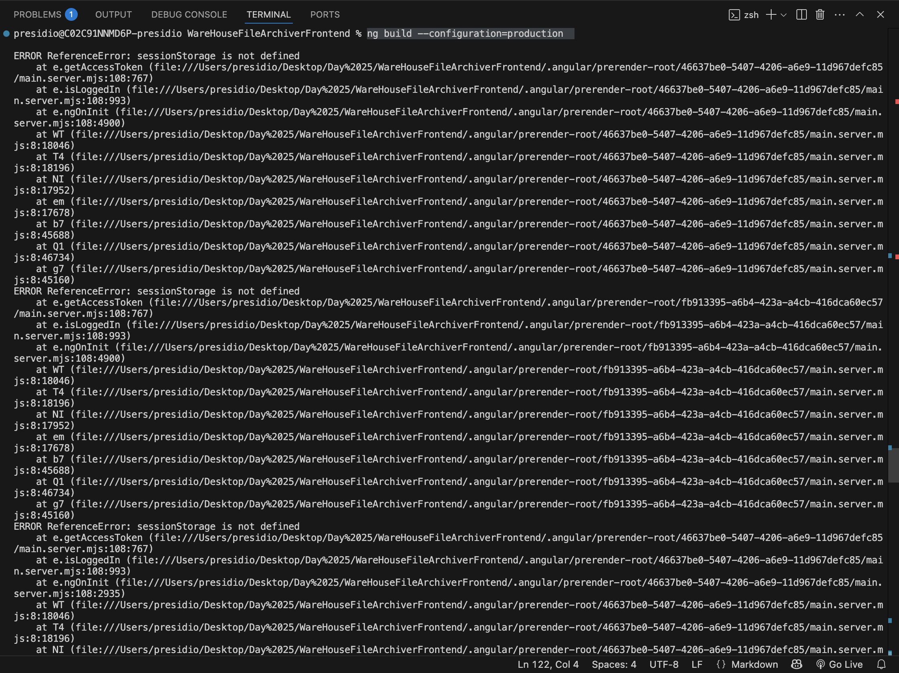

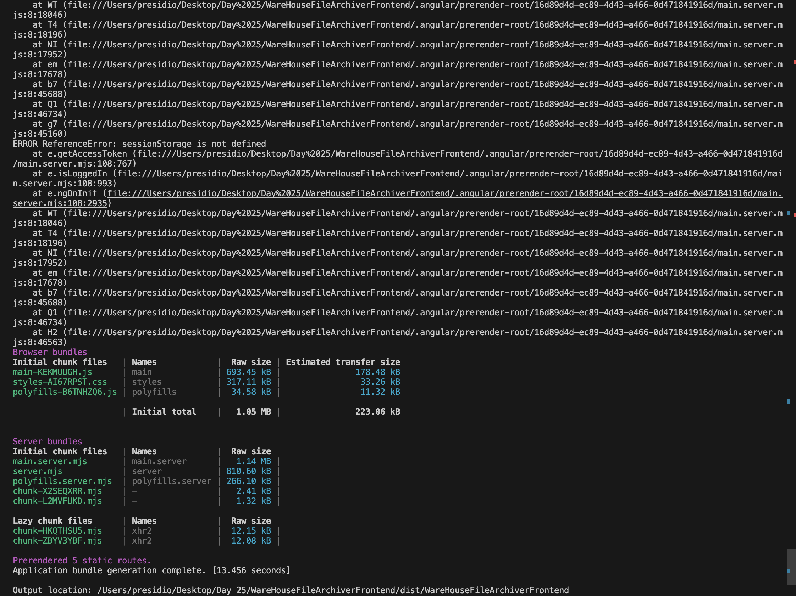


This will create a folder with dist/ within the application

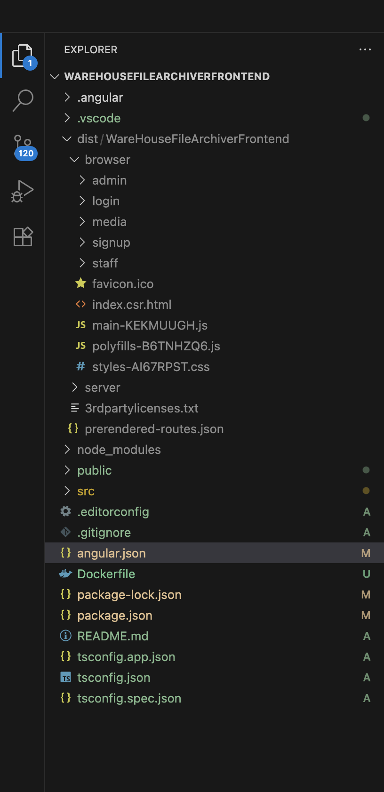

### create a Dockerfile with correct node --version 

```
FROM node:20.19.2-alpine AS build
 
WORKDIR /app
 
COPY package*.json ./
 
RUN npm install
 
RUN npm install -g @angular/cli
 
COPY . .
 
RUN ng build --configuration=production
 
FROM nginx:latest
 
COPY --from=build /app/dist/WareHouseFileArchiverFrontend/browser /usr/share/nginx/html
 
EXPOSE 80
```

### Build the images

```
docker build -t warehousefrontend .
```

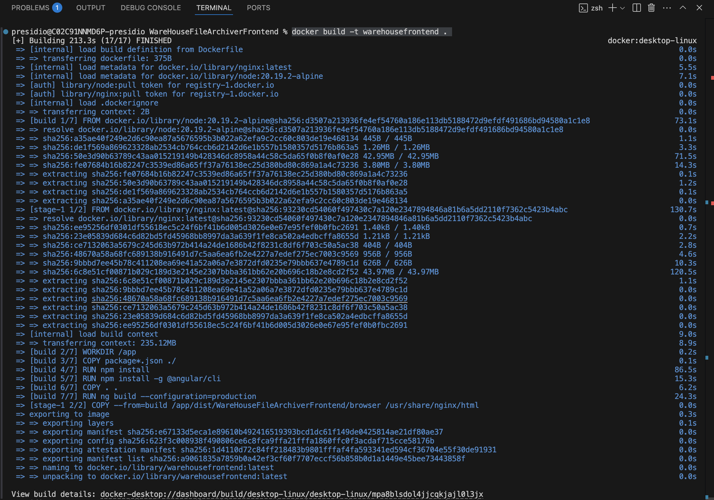


### Execute the image by creating a container

```
docker run -d -p 4200:80 warehousefrontend 
```

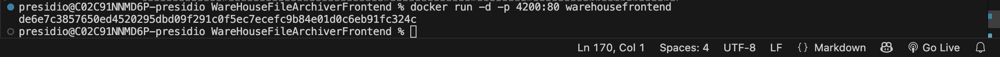

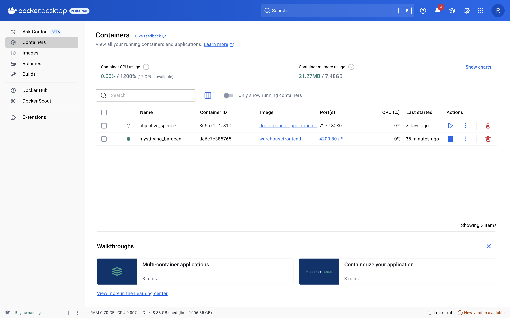

Visit: 
http://localhost:4200/login

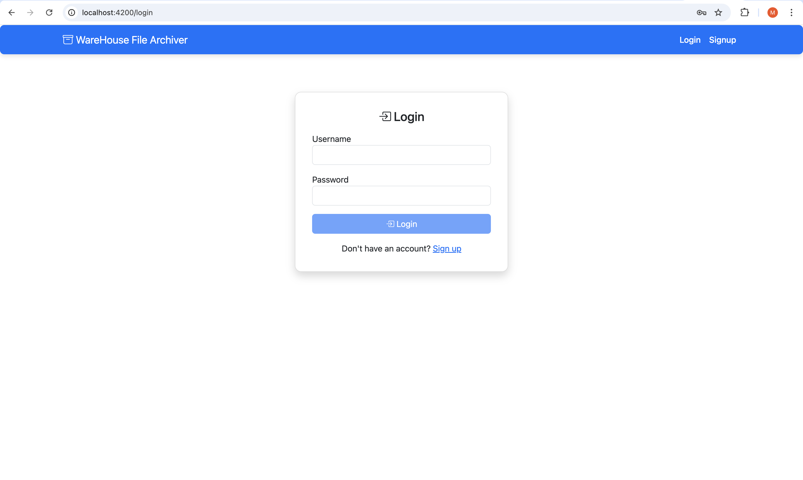


## 2. Use of Dockerfile for Backend with SSL

```
# Base image used for running the app
FROM mcr.microsoft.com/dotnet/aspnet:8.0 AS base
WORKDIR /app

# Install openssl to generate certificates
RUN apt-get update && apt-get install -y openssl

# Generate self-signed certificate
RUN mkdir /https && \
    openssl req -x509 -nodes -days 365 \
      -newkey rsa:2048 \
      -keyout /https/aspnetcore.key \
      -out /https/aspnetcore.crt \
      -subj "/CN=localhost" && \
    openssl pkcs12 -export \
      -out /https/aspnetcore.pfx \
      -inkey /https/aspnetcore.key \
      -in /https/aspnetcore.crt \
      -passout pass:password

EXPOSE 8080
EXPOSE 8081

# Build image
FROM mcr.microsoft.com/dotnet/sdk:8.0 AS build
ARG BUILD_CONFIGURATION=Release
WORKDIR /src
COPY ["WebApplication1/WebApplication1.csproj", "WebApplication1/"]
RUN dotnet restore "./WebApplication1/WebApplication1.csproj"
COPY . .
WORKDIR "/src/WebApplication1"
RUN dotnet build "./WebApplication1.csproj" -c $BUILD_CONFIGURATION -o /app/build

# Publish image
FROM build AS publish
ARG BUILD_CONFIGURATION=Release
RUN dotnet publish "./WebApplication1.csproj" -c $BUILD_CONFIGURATION -o /app/publish /p:UseAppHost=false

# Final runtime image
FROM base AS final
WORKDIR /app

# Copy published app
COPY --from=publish /app/publish .

# Environment variable for Development to enable Swagger
ENV ASPNETCORE_ENVIRONMENT=Development

# Configure Kestrel URLs
ENV ASPNETCORE_URLS="http://+:8080;https://+:8081"


ENTRYPOINT ["dotnet", "WebApplication1.dll"]
```

### appsettings.json

```
{
  "Logging": {
    "LogLevel": {
      "Default": "Information",
      "Microsoft.AspNetCore": "Warning"
    }
  },
  "AllowedHosts": "*",
  "Kestrel": {
    "Endpoints": {
      "Https": {
        "Url": "https://+:8081",
        "Certificate": {
          "Path": "/https/aspnetcore.pfx",
          "Password": "password"
        }
      },
      "Http": {
        "Url": "http://+:8080"
      }
    }
  }

}
```


## 3. Docker Swarm

### api/index.json

```
const express = require("express");
const app = express();

app.get("/api", (req, res) => {
  res.json({ message: "Hello from the API!" });
});

app.listen(3000, () => console.log("API running on port 3000"));
```

### api/package.json

```
{
  "name": "api",
  "version": "1.0.0",
  "main": "index.js",
  "dependencies": {
    "express": "^4.18.2"
  }
}
```

### api/Dockerfile

```
# api/Dockerfile
FROM node:20-alpine
WORKDIR /app
COPY package.json .
RUN npm install
COPY index.js .
EXPOSE 3000
CMD ["node", "index.js"]
```

### web/index.html

```
<!DOCTYPE html>
<html>
<head>
  <title>Docker Swarm Example</title>
</head>
<body>
  <h1>Hello from the frontend!</h1>
  <p>This is served by Nginx in Docker Swarm.</p>
</body>
</html>
```

### web/Dockerfile

```
# web/Dockerfile
FROM nginx:alpine
COPY index.html /usr/share/nginx/html/index.html
EXPOSE 80
```

### docker-compose.yml

```
version: "3.8"

services:
  api:
    image: api:latest
    ports:
      - "3000:3000"
    deploy:
      replicas: 2
      resources:
        limits:
          cpus: "0.25"
          memory: 128M
      restart_policy:
        condition: on-failure

  web:
    image: web:latest
    ports:
      - "8080:80"
    deploy:
      replicas: 2
      resources:
        limits:
          cpus: "0.25"
          memory: 64M
      restart_policy:
        condition: on-failure
```

### In terminal

```
docker swarm init
```

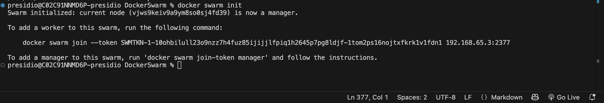

Build images

```
docker build -t api:latest ./api
```

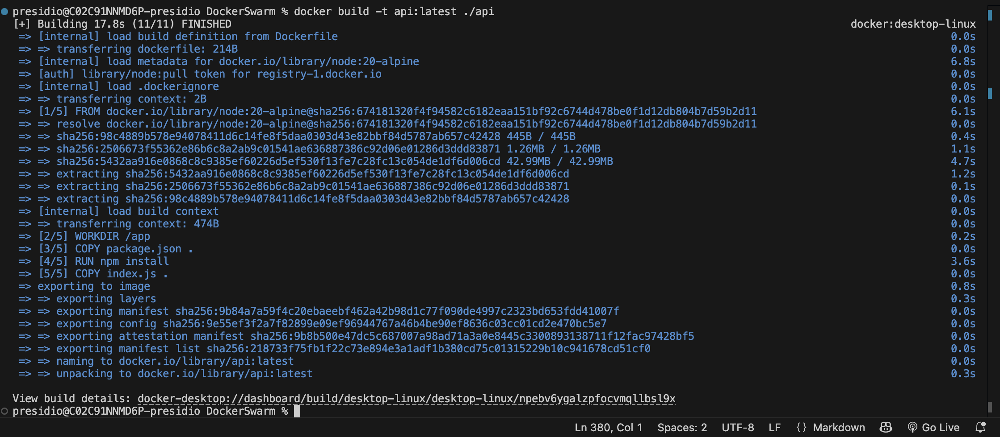


```
docker build -t web:latest ./web
```

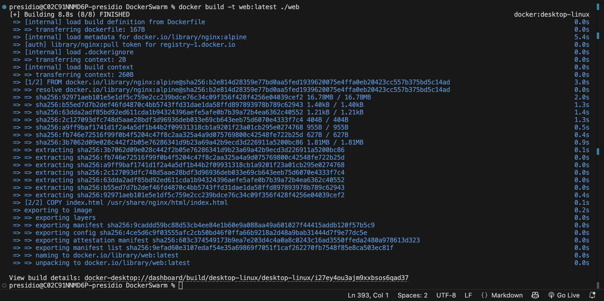


Create Containers

```
docker stack deploy -c docker-compose.yml mystack
```

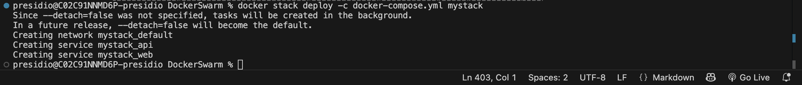

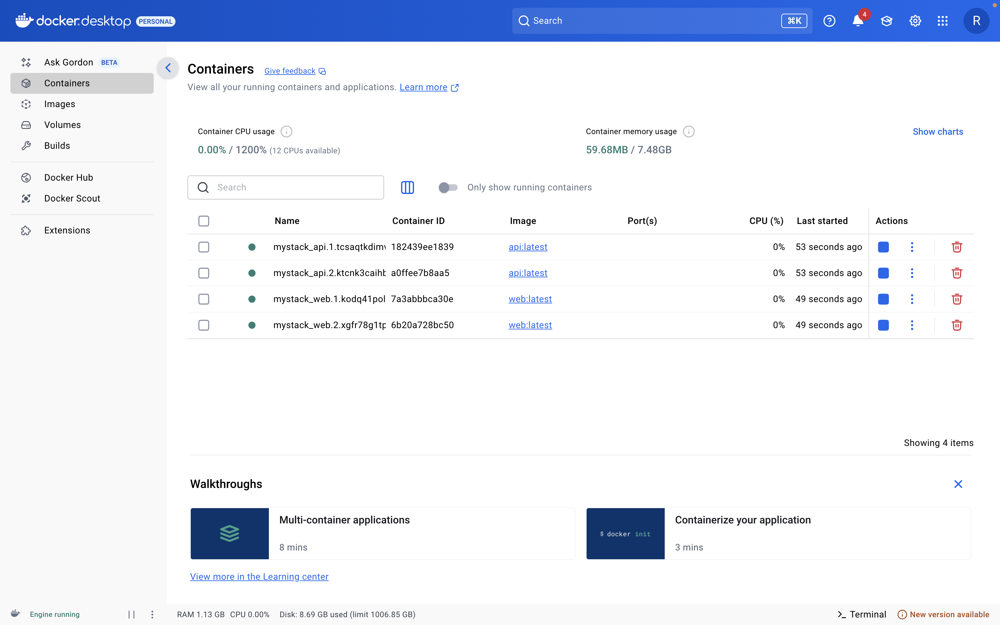

```
docker stack services mystack
```

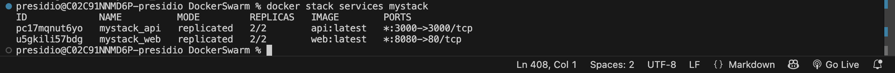

```
docker service scale mystack_web=5
```

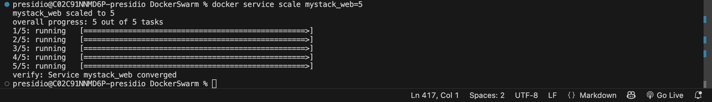

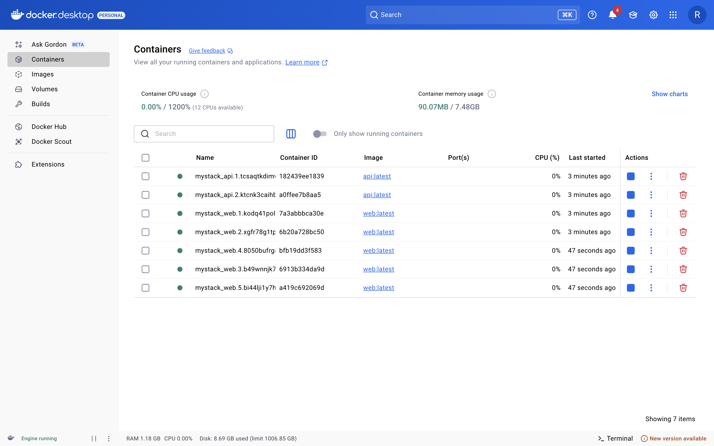

Visit : 
http://localhost:8080/

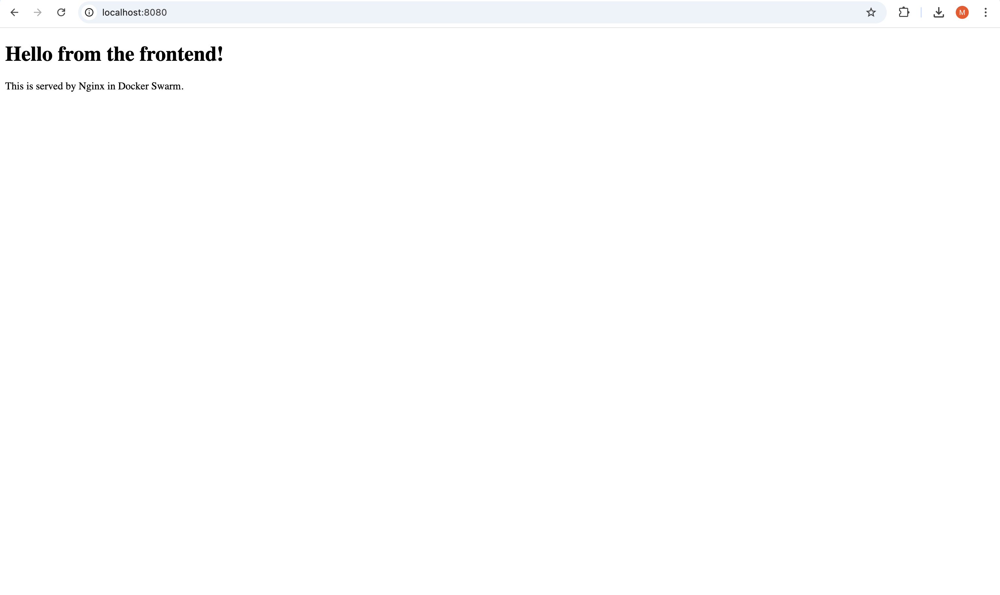


Deleting Containers

```
docker stack rm mystack
```

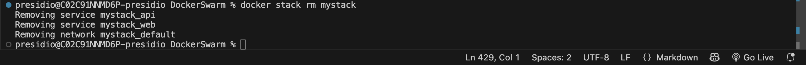

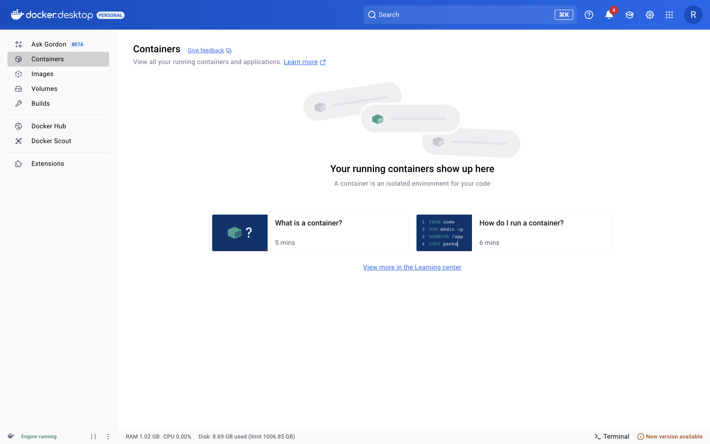


```
docker swarm leave --force
```

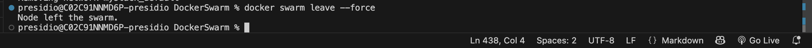


## Docker Network

### api/Dockerfile

```
# api/Dockerfile
FROM node:20-alpine
WORKDIR /app
COPY package.json .
RUN npm install
COPY index.js .
EXPOSE 3000
CMD ["node", "index.js"]
```

### api/index.js

```
const express = require("express");
const app = express();

app.get("/api", (req, res) => {
  res.json({ message: "Hello from the API!" });
});

app.listen(3000, () => console.log("API running on port 3000"));
```

### api/package.json

```
{
  "name": "api",
  "version": "1.0.0",
  "main": "index.js",
  "dependencies": {
    "express": "^4.18.2"
  }
}
```

### web/Dockerfile

```
FROM nginx:alpine
COPY index.html /usr/share/nginx/html/index.html
COPY nginx.conf /etc/nginx/nginx.conf
EXPOSE 80
```

### web/index.html

```
<!DOCTYPE html>
<html>
<head>
  <title>Frontend with API Call</title>
  <script>
    async function loadData() {
      const res = await fetch('/api');
      const data = await res.json();
      document.getElementById('apiResponse').innerText = data.message;
    }
    window.onload = loadData;
  </script>
</head>
<body>
  <h1>Docker Swarm Network Example</h1>
  <p>API says: <span id="apiResponse">Loading...</span></p>
</body>
</html>
```

### web/nginx.conf

```
events { }

http {
  server {
    listen 80;

    location / {
      root /usr/share/nginx/html;
      index index.html;
    }

    location /api {
      proxy_pass http://api:3000;
    }
  }
}
```

### docker-compose.yml

```
version: "3.8"

services:
  api:
    image: api:latest
    build: ./api
    networks:
      - appnet
    deploy:
      replicas: 2
      restart_policy:
        condition: on-failure

  web:
    image: web:latest
    build: ./web
    ports:
      - "8080:80"
    networks:
      - appnet
    deploy:
      replicas: 2
      restart_policy:
        condition: on-failure

networks:
  appnet:
```

### Terminal

```
docker swarm init   
```

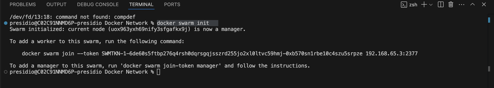


Building images

```
docker build -t api:latest ./api
```

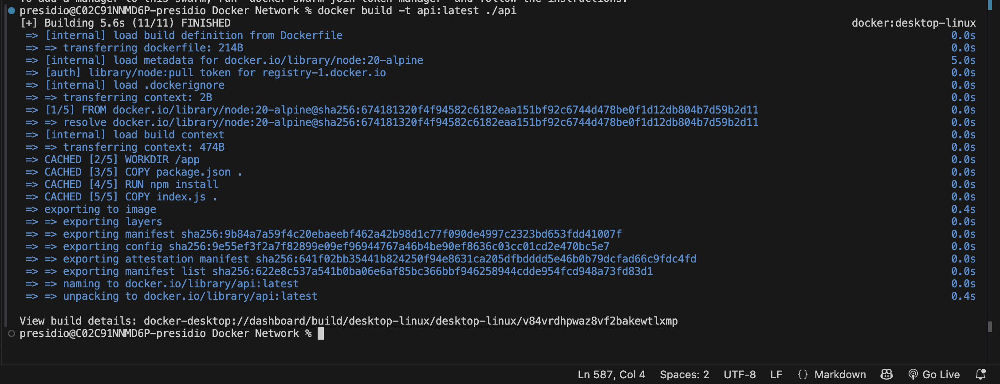


```
docker build -t web:latest ./web 
```

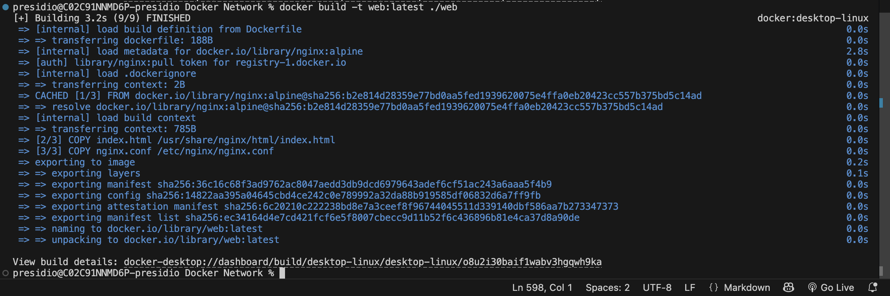

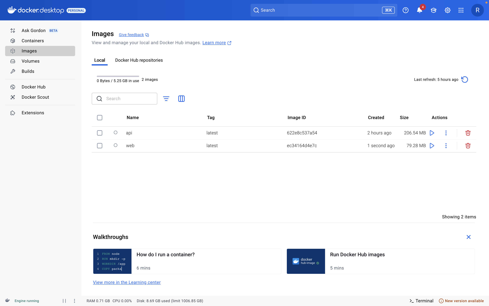

Build Containers

```
docker stack deploy -c docker-compose.yml mystack
```

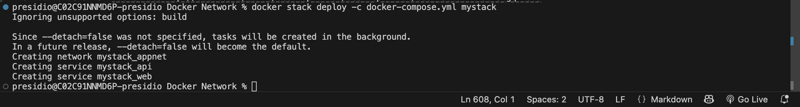

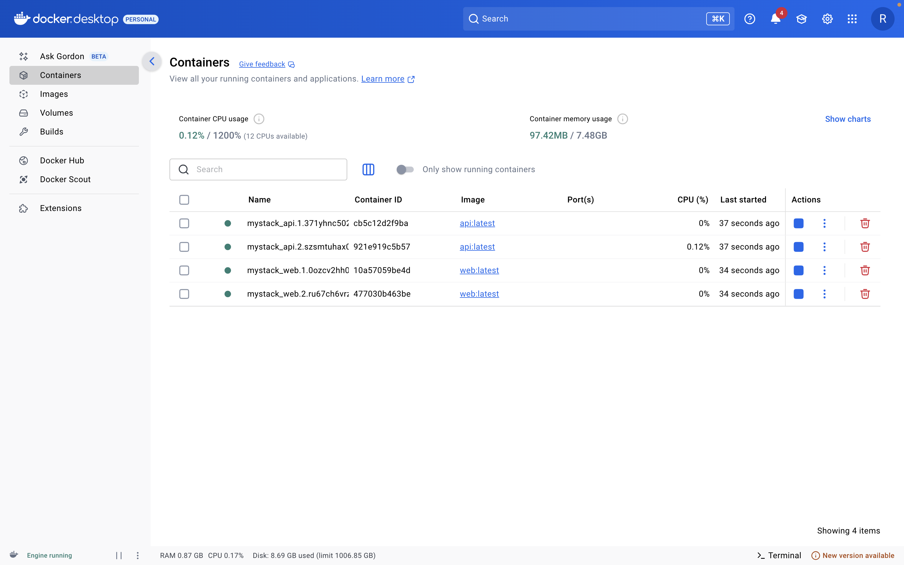

```
docker stack services mystack 
```

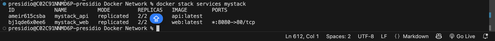


```
docker service scale mystack_web=5  
```

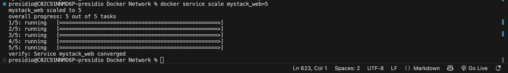

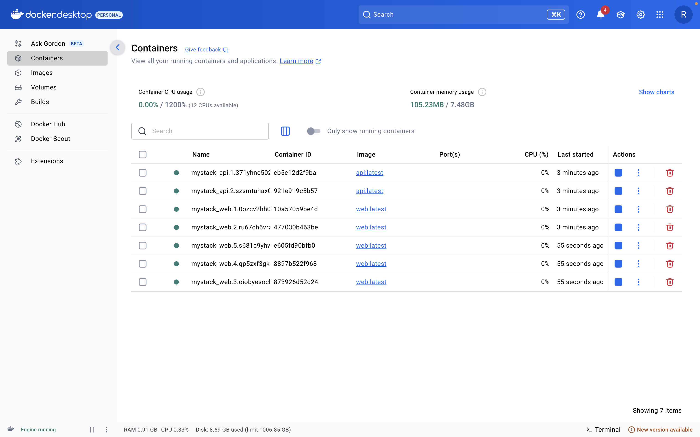

Visit:
http://localhost:8080/

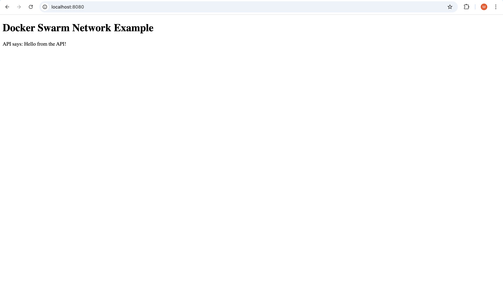

```
docker stack rm mystack                          
```

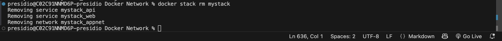


```
docker swarm leave --force 
```

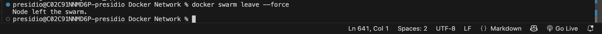

