# RazorPayUpiApp

This project was generated using [Angular CLI](https://github.com/angular/angular-cli) version 20.0.3.

## Development server

To start a local development server, run:

```bash
ng serve
```

Once the server is running, open your browser and navigate to `http://localhost:4200/`. The application will automatically reload whenever you modify any of the source files.

## Code scaffolding

Angular CLI includes powerful code scaffolding tools. To generate a new component, run:

```bash
ng generate component component-name
```

For a complete list of available schematics (such as `components`, `directives`, or `pipes`), run:

```bash
ng generate --help
```

## Building

To build the project run:

```bash
ng build
```

This will compile your project and store the build artifacts in the `dist/` directory. By default, the production build optimizes your application for performance and speed.

## Running unit tests

To execute unit tests with the [Karma](https://karma-runner.github.io) test runner, use the following command:

```bash
ng test
```

## Running end-to-end tests

For end-to-end (e2e) testing, run:

```bash
ng e2e
```

Angular CLI does not come with an end-to-end testing framework by default. You can choose one that suits your needs.

## Additional Resources

For more information on using the Angular CLI, including detailed command references, visit the [Angular CLI Overview and Command Reference](https://angular.dev/tools/cli) page.


## Code with Output

### index.html

```
<html lang="en">
<head>
  <meta charset="utf-8">
  <title>RazorPayUpiApp</title>
  <base href="/">
  <meta name="viewport" content="width=device-width, initial-scale=1">
  <script src="https://checkout.razorpay.com/v1/checkout.js"></script>
  <link rel="stylesheet" href="https://cdn.jsdelivr.net/npm/bootstrap@4.6.2/dist/css/bootstrap.min.css">
  <link rel="stylesheet" href="https://cdn.jsdelivr.net/npm/bootstrap-icons@1.10.5/font/bootstrap-icons.css">
</head>
<body>
  <app-root></app-root>
</body>
</html>
```

### styles.css

```
/* You can add global styles to this file, and also import other style files */
@import url('bootstrap/dist/css/bootstrap.css');
@import url('bootstrap-icons/font/bootstrap-icons.css');

body {
  font-family: Arial, sans-serif;
  background-color: #f8f9fa;
} 
```

### razorpay.service.ts

```
import { Injectable } from "@angular/core";

@Injectable({ providedIn: 'root' })
export class RazorpayService {
  private razorpayKey = 'rzp_test_ROHITH_KEY';

  createRazorpayOptions(data: any, successCallback: Function, cancelCallback: Function): any {
    return {
      key: this.razorpayKey,
      amount: data.amount * 100,
      currency: 'INR',
      name: data.name,
      description: 'UPI Payment Test',
      prefill: {
        name: data.name,
        email: data.email,
        contact: data.contact
      },
      method: {
        upi: true,
        netbanking: true,
        card: true,
        wallet: true
      },
      theme: {
        color: '#007bff'
      },
      handler: (response: any) => successCallback(response),
      modal: {
        ondismiss: () => cancelCallback()
      }
    };
  }

  launchRazorpay(options: any): void {
    const rzp = new (window as any).Razorpay(options);
    rzp.open();
  }
}
```

### paymentrecord.model.ts

```
export interface PaymentRecord {
  id: string;                      // Razorpay Payment ID or 'N/A' if cancelled
  amount: number;                  // Payment amount in INR
  status: 'success' | 'cancelled'; // Payment status
  date: Date;                      // Timestamp of the transaction
}
```

### razorpay.d.ts

```
declare var Razorpay : any
```

### payment.ts

```
import { Component, OnInit } from '@angular/core';
import { FormBuilder, FormControl, FormGroup, FormsModule, ReactiveFormsModule, Validators } from '@angular/forms';
import { CommonModule } from '@angular/common';
import { RazorpayService } from '../services/razorpay.service';
import { PaymentRecord } from '../models/paymentrecord.model';


@Component({
  selector: 'app-payment',
  imports: [CommonModule, ReactiveFormsModule],
  templateUrl: './payment.html',
  styleUrl: './payment.css'
})
export class PaymentComponent{
  paymentForm: FormGroup;
  paymentStatus: string | null = null;
  paymentId: string | null = null;
  paymentHistory: PaymentRecord[] = [];

  constructor(private fb: FormBuilder, private razorpayService: RazorpayService) {
    this.paymentForm = this.fb.group({
      amount: ['', [Validators.required, Validators.min(1)]],
      name: ['', Validators.required],
      email: ['', [Validators.required, Validators.email]],
      contact: ['', [Validators.required, Validators.pattern(/^\d{10}$/)]]
    });
  }

  get amount() { return this.paymentForm.get('amount'); }
  get name() { return this.paymentForm.get('name'); }
  get email() { return this.paymentForm.get('email'); }
  get contact() { return this.paymentForm.get('contact'); }

  pay(): void {
    if (this.paymentForm.invalid) return;

    const formData = this.paymentForm.value;
    const options = this.razorpayService.createRazorpayOptions(
      formData,
      (response: any) => {
        this.paymentStatus = 'success';
        this.paymentId = response.razorpay_payment_id;
        this.addToHistory(this.paymentId!, formData.amount, 'success');
      },
      () => {
        this.paymentStatus = 'cancelled';
        this.addToHistory('N/A', formData.amount, 'cancelled');
      }
    );

    this.razorpayService.launchRazorpay(options);
  }

  addToHistory(id: string, amount: number, status: 'success' | 'cancelled') {
    this.paymentHistory.unshift({ id, amount, status, date: new Date() });
  }
}
```

### payment.html

```
<div class="container py-5">
  <div class="card shadow-sm">
    <div class="card-header bg-primary text-white">
      <h4 class="mb-0"><i class="bi bi-credit-card"></i> UPI Payment Form</h4>
    </div>
    <div class="card-body">
      <form [formGroup]="paymentForm" (ngSubmit)="pay()">
        <div class="form-group mb-3">
          <label>Amount (INR)</label>
          <input type="number" class="form-control" formControlName="amount" />
          @if(amount?.touched && amount?.errors) {
            <div class="text-danger">Amount must be greater than 0</div>
          }
        </div>
        <div class="form-group mb-3">
          <label>Name</label>
          <input type="text" class="form-control" formControlName="name" />
          @if(name?.touched && name?.errors) {
            <div class="text-danger">Name is required</div>
          }
        </div>
        <div class="form-group mb-3">
          <label>Email</label>
          <input type="email" class="form-control" formControlName="email" />
          @if(email?.touched && email?.errors) {
            @if(email?.errors?.['required']) {
              <div class="text-danger">Email is required</div>
            }
            @if(email?.errors?.['email']) {
              <div class="text-danger">Invalid email format</div>
            }
          }
        </div>
        <div class="form-group mb-4">
          <label>Contact Number</label>
          <input type="text" class="form-control" formControlName="contact" />
          @if(contact?.touched && contact?.errors) {
            @if(contact?.errors?.['required']) {
              <div class="text-danger">Contact is required</div>
            }
            @if(contact?.errors?.['pattern']) {
              <div class="text-danger">Contact must be exactly 10 digits</div>
            }
          }
        </div>
        <button class="btn btn-success w-100" type="submit" [disabled]="paymentForm.invalid">
          <i class="bi bi-lightning-fill"></i> Pay with Razorpay
        </button>
      </form>

      <div *ngIf="paymentStatus === 'success'" class="alert alert-success mt-4">
        <i class="bi bi-check-circle-fill"></i> Payment Successful! Payment ID: {{ paymentId }}
      </div>
      <div *ngIf="paymentStatus === 'cancelled'" class="alert alert-warning mt-4">
        <i class="bi bi-x-circle-fill"></i> Payment was cancelled.
      </div>
    </div>
  </div>

  <div class="mt-5">
    <h5><i class="bi bi-clock-history"></i> Payment History</h5>
    <div *ngIf="paymentHistory.length === 0" class="text-muted">No payments yet.</div>
    <div *ngFor="let record of paymentHistory" class="card my-2">
      <div class="card-body d-flex justify-content-between align-items-center">
        <div>
          <div><strong>Amount:</strong> ₹{{ record.amount }}</div>
          <div><strong>Status:</strong> <span [class]="record.status === 'success' ? 'text-success' : 'text-warning'">{{ record.status }}</span></div>
          <div><strong>Time:</strong> {{ record.date | date:'short' }}</div>
        </div>
        <div>
          <strong>ID:</strong><br /> {{ record.id }}
        </div>
      </div>
    </div>
  </div>
</div>
```

### payment.css

```
.container {
  max-width: 600px;
  margin: 60px auto;
}
.card {
  box-shadow: 0 4px 12px rgba(0, 0, 0, 0.1);
}
```

### app.config.ts

```
import { ApplicationConfig, provideBrowserGlobalErrorListeners, provideZoneChangeDetection } from '@angular/core';
import { provideRouter } from '@angular/router';

import { routes } from './app.routes';
import { provideClientHydration, withEventReplay } from '@angular/platform-browser';
import { RazorpayService } from './services/razorpay.service';

export const appConfig: ApplicationConfig = {
  providers: [
    provideBrowserGlobalErrorListeners(),
    provideZoneChangeDetection({ eventCoalescing: true }),
    provideRouter(routes), provideClientHydration(withEventReplay()),
    RazorpayService
  ]
};
```

### app.html

```
<app-payment/>
```

### terminal

```
ng serve
```

Visit: 

http://localhost:4200/

### Output

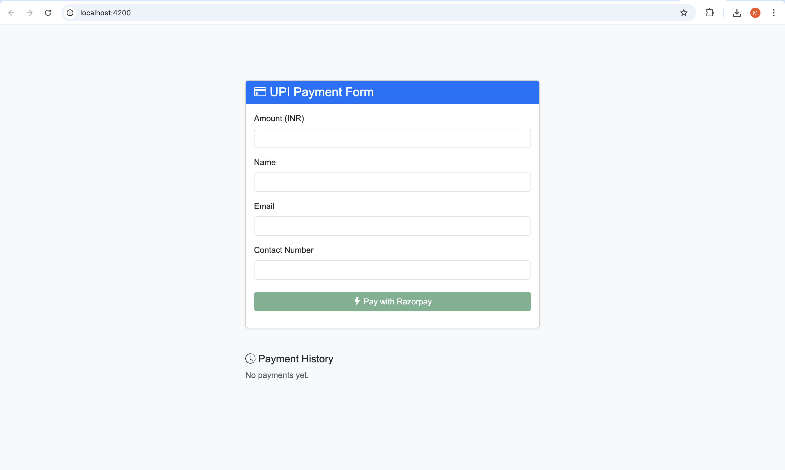


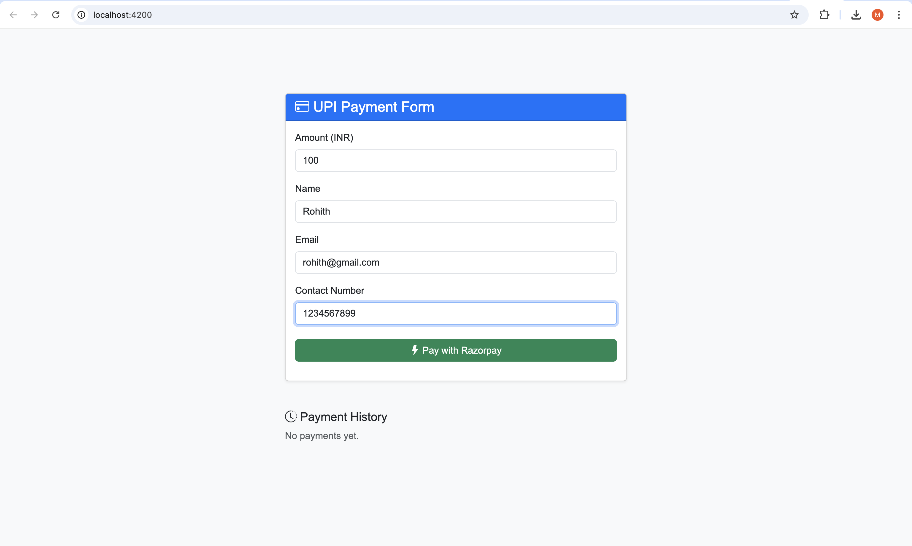


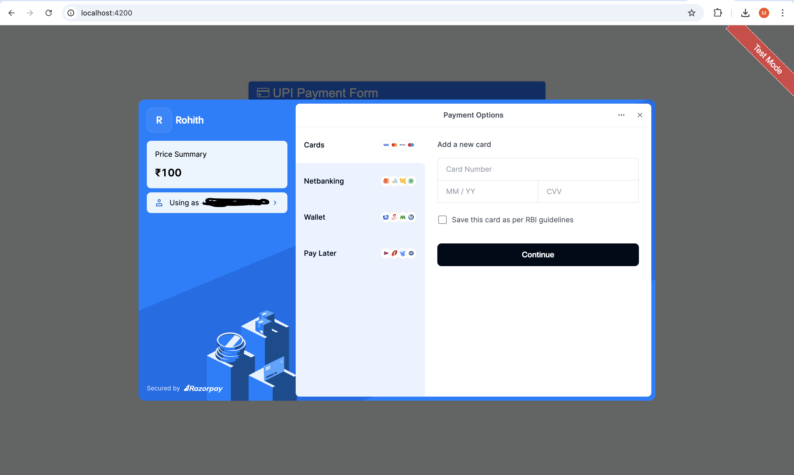


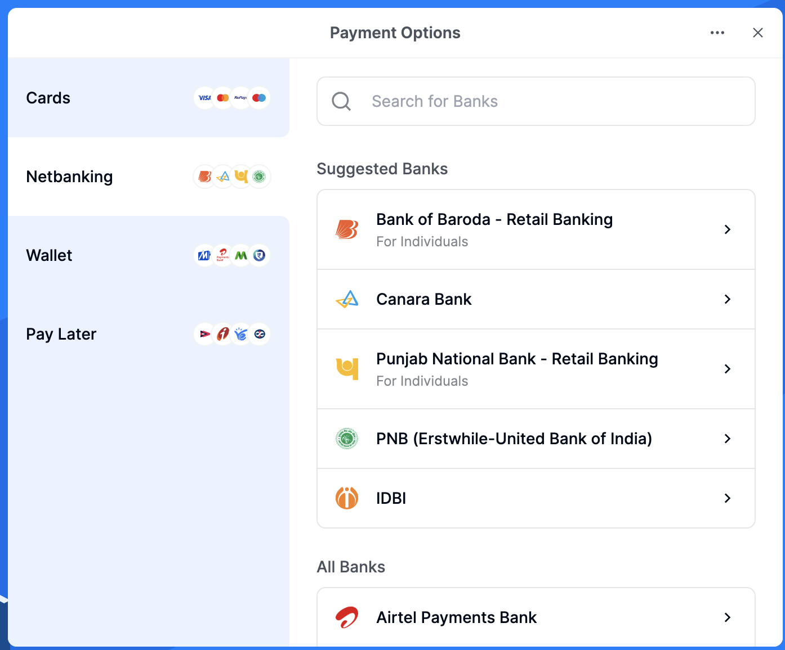


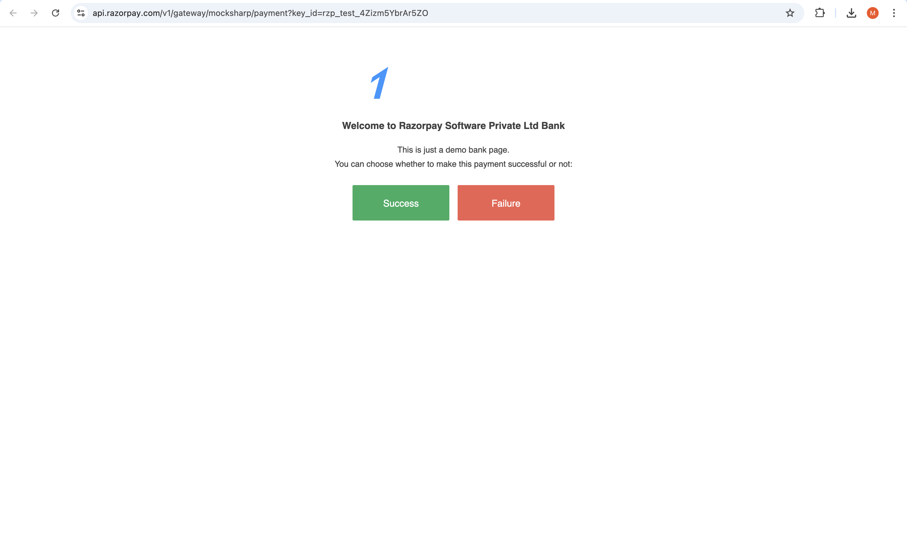


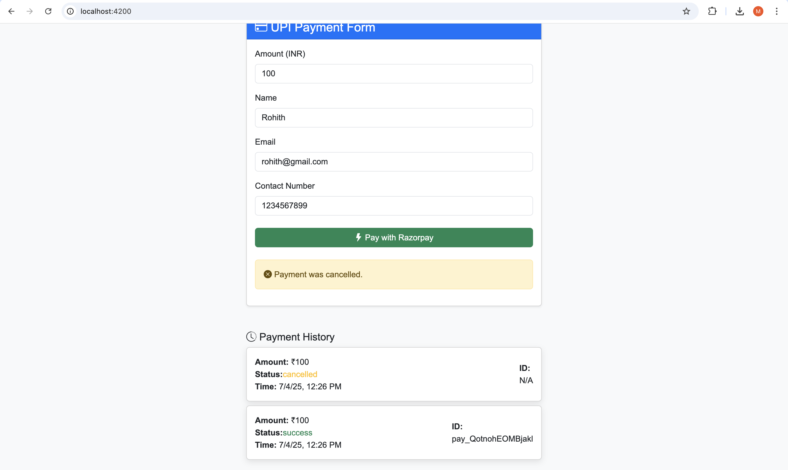


### Unit testing using Jasmine and Karma

### payment.spec.ts

```
import { ComponentFixture, TestBed } from '@angular/core/testing';
import { PaymentComponent } from './payment';
import { ReactiveFormsModule } from '@angular/forms';
import { CommonModule } from '@angular/common';
import { RazorpayService } from '../services/razorpay.service';
import { By } from '@angular/platform-browser';

describe('PaymentComponent', () => {
  let component: PaymentComponent;
  let fixture: ComponentFixture<PaymentComponent>;
  let mockRazorpayService: jasmine.SpyObj<RazorpayService>;

  beforeEach(async () => {
    mockRazorpayService = jasmine.createSpyObj('RazorpayService', ['createRazorpayOptions', 'launchRazorpay']);

    await TestBed.configureTestingModule({
      imports: [PaymentComponent, CommonModule, ReactiveFormsModule],
      providers: [{ provide: RazorpayService, useValue: mockRazorpayService }],
    }).compileComponents();

    fixture = TestBed.createComponent(PaymentComponent);
    component = fixture.componentInstance;
    fixture.detectChanges();
  });

  it('should create the component', () => {
    expect(component).toBeTruthy();
  });

  it('should mark form as invalid when empty', () => {
    expect(component.paymentForm.invalid).toBeTrue();
  });

  it('should validate contact number length (10 digits)', () => {
    const contact = component.contact;
    contact?.setValue('12345');
    expect(contact?.valid).toBeFalse();
    contact?.setValue('1234567890');
    expect(contact?.valid).toBeTrue();
  });

  it('should enable submit when form is valid', () => {
    component.paymentForm.setValue({
      amount: 100,
      name: 'Test User',
      email: 'test@example.com',
      contact: '9876543210'
    });
    expect(component.paymentForm.valid).toBeTrue();
  });

  it('should add to history after success', () => {
    component.addToHistory('pay_test_123', 500, 'success');
    expect(component.paymentHistory.length).toBe(1);
    expect(component.paymentHistory[0].id).toBe('pay_test_123');
  });

  it('should call RazorpayService when pay() is called with valid form', () => {
    const dummyFormData = {
      amount: 200,
      name: 'User',
      email: 'user@mail.com',
      contact: '9999999999'
    };

    component.paymentForm.setValue(dummyFormData);

    const mockOptions = {};
    mockRazorpayService.createRazorpayOptions.and.returnValue(mockOptions);

    component.pay();

    expect(mockRazorpayService.createRazorpayOptions).toHaveBeenCalledWith(
      dummyFormData,
      jasmine.any(Function),
      jasmine.any(Function)
    );
    expect(mockRazorpayService.launchRazorpay).toHaveBeenCalledWith(mockOptions);
  });
});
```

### app.spec.ts

```
import { ComponentFixture, TestBed } from '@angular/core/testing';
import { App } from './app';
import { PaymentComponent } from './payment/payment';

describe('App', () => {
  let fixture: ComponentFixture<App>;
  let component: App;

  beforeEach(async () => {
    await TestBed.configureTestingModule({
      imports: [App, PaymentComponent],
    }).compileComponents();

    fixture = TestBed.createComponent(App);
    component = fixture.componentInstance;
    fixture.detectChanges();
  });

  it('should create the app', () => {
    expect(component).toBeTruthy();
  });

  it('should render PaymentComponent', () => {
    const compiled = fixture.nativeElement as HTMLElement;
    expect(compiled.querySelector('app-payment')).toBeTruthy();
  });

  it('should have correct title', () => {
    expect(component['title']).toBe('RazorPayUpiApp');
  });
});
```

### in terminal 

```
ng test
```

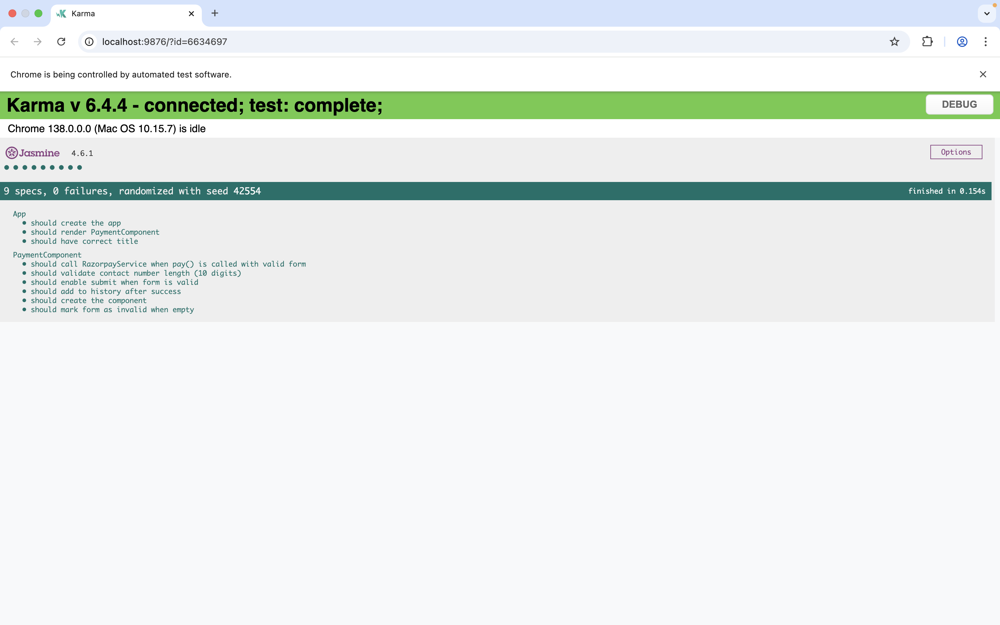


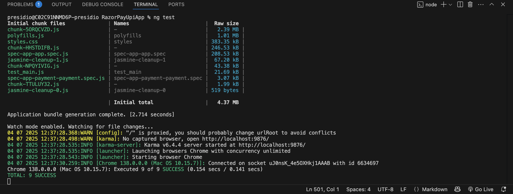


### Dockerfile

```
# Stage 1: Build the Angular app
FROM node:20-alpine AS builder

# Set working directory
WORKDIR /app

# Copy package files and install dependencies
COPY package*.json ./
RUN npm install

# Copy source files and build the Angular app
COPY . .
RUN npm run build --prod

# Stage 2: Serve the built app using Nginx
FROM nginx:stable-alpine

# Copy built Angular app from Stage 1
COPY --from=builder /app/dist/RazorPayUpiApp/browser /usr/share/nginx/html

# Copy custom nginx config if needed (optional)
# COPY nginx.conf /etc/nginx/nginx.conf

# Expose port
EXPOSE 80

# Start Nginx server
CMD ["nginx", "-g", "daemon off;"]


```

### styles.css

```
/* You can add global styles to this file, and also import other style files */
@import 'bootstrap/dist/css/bootstrap.css';
@import 'bootstrap-icons/font/bootstrap-icons.css';

body {
  font-family: Arial, sans-serif;
  background-color: #f8f9fa;
} 
```

### Copy the production files

```
ng build --configuration=production
```

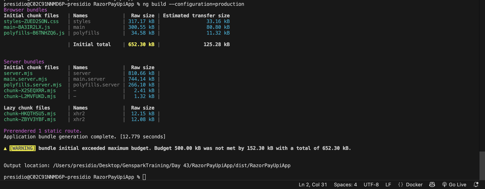

### Build the docker image

```
docker build --no-cache -t razorpay-upi-app .
```

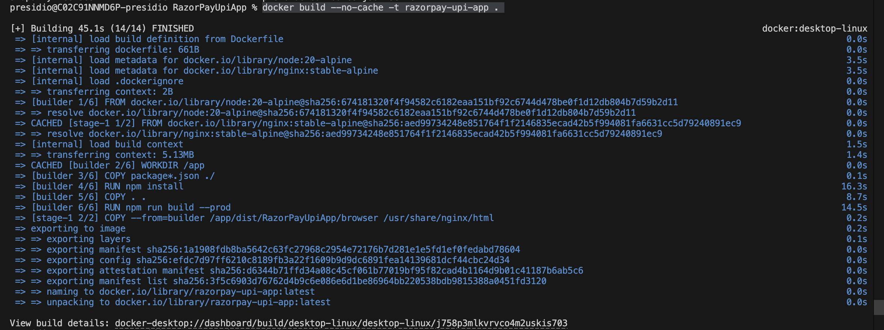

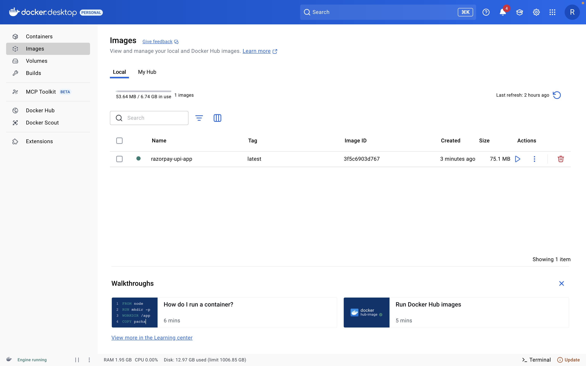


### Run the container (on port 8080)

```
docker run -p 8080:80 razorpay-upi-app
```

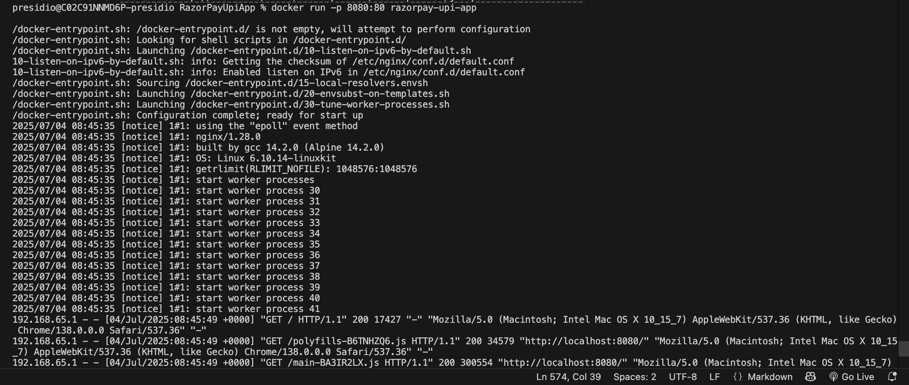

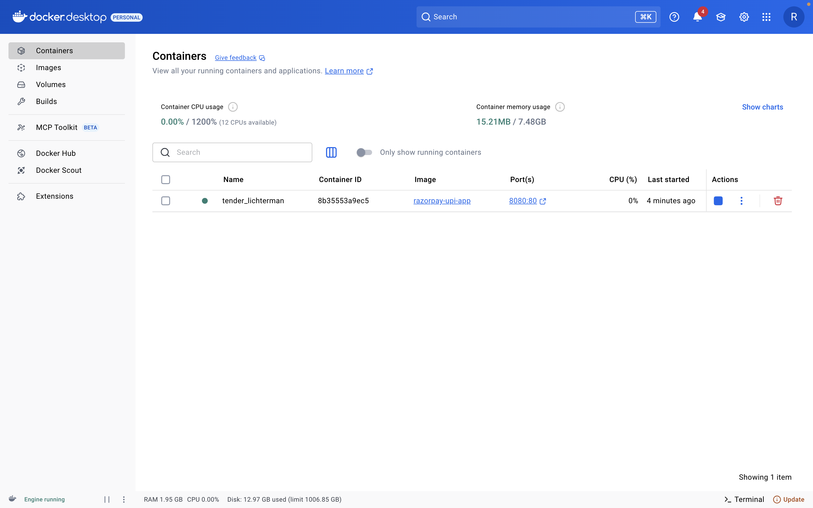

open

http://localhost:8080

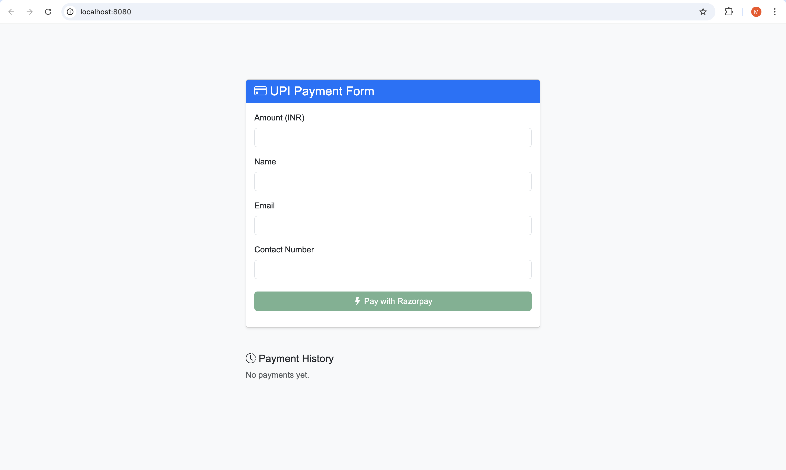
