# Creation of Azure Functions

## Creation of New Storage Account

```
az login
```

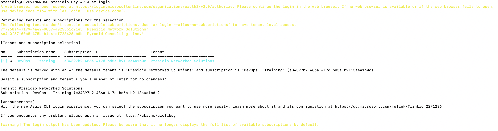


### Storage Account: rohithazureblob

```
az storage account create --name rohithazureblob --location eastus --resource-group Rohith_GenSparkTraining --sku Standard_LRS
```

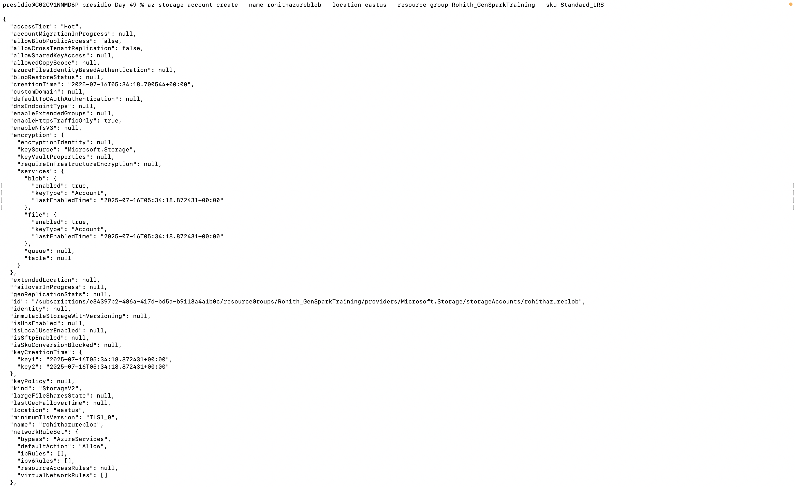

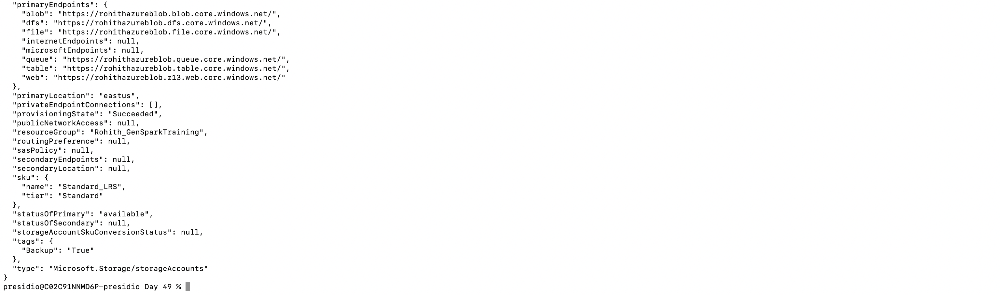

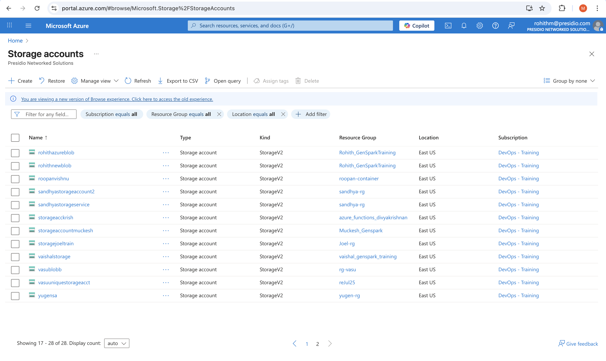

## Creation of Function App

### funcionapp name: rohithdotnetfunc

```
az functionapp create --resource-group Rohith_GenSparkTraining --consumption-plan-location eastus --name rohithdotnetfunc --storage-account rohithazureblob --runtime dotnet-isolated --functions-version 4
```

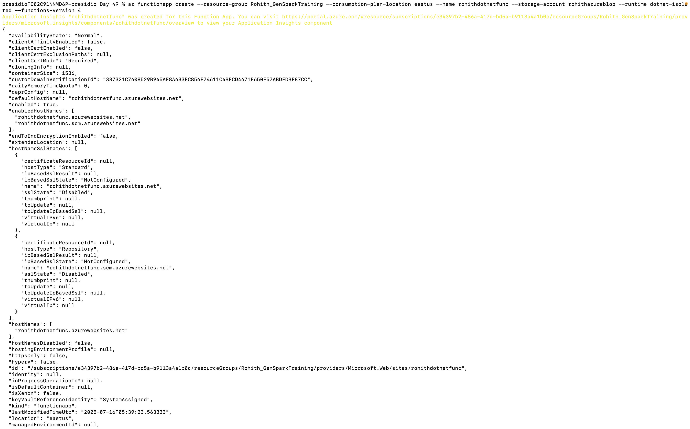

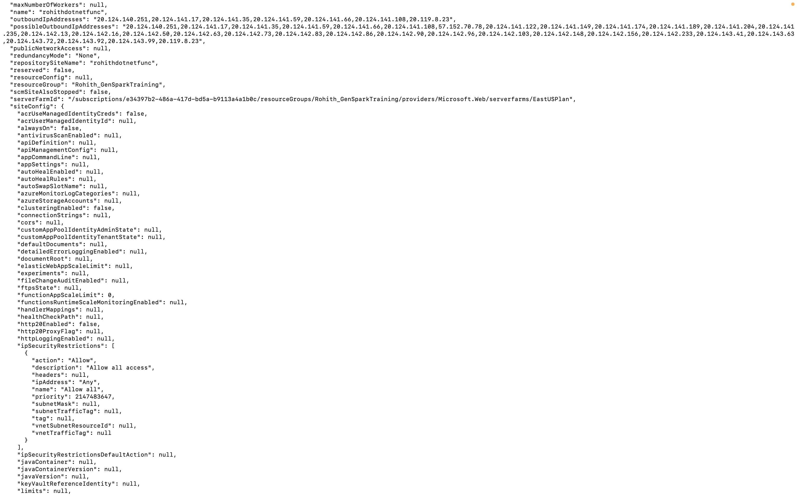

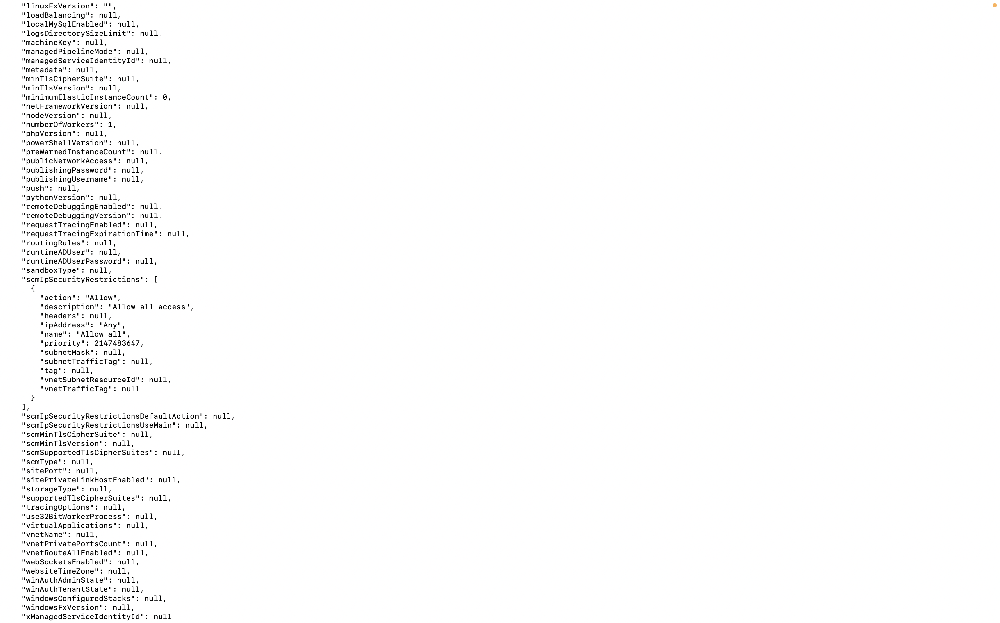

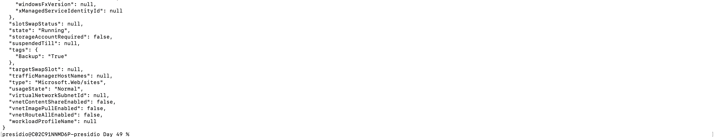

- Search for Function App in Azure: https://portal.azure.com/#home

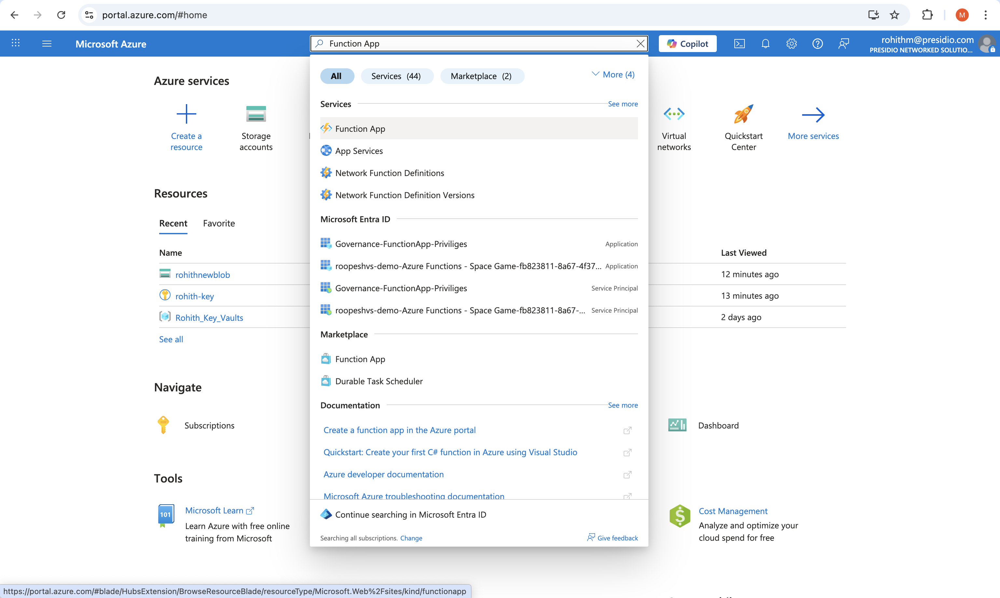

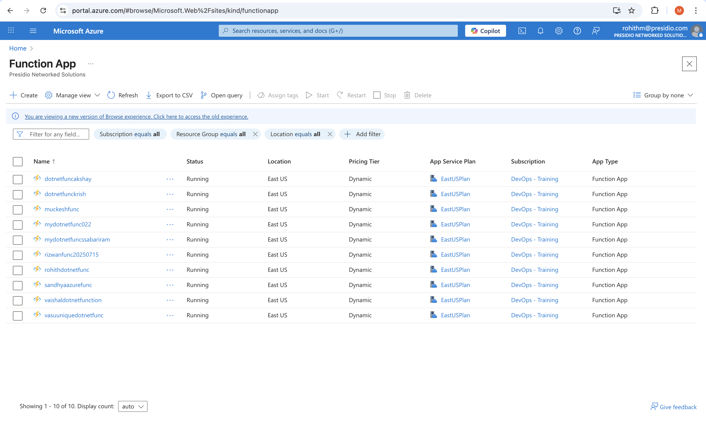

### Configuring functionapp with Azure Storage Connection String

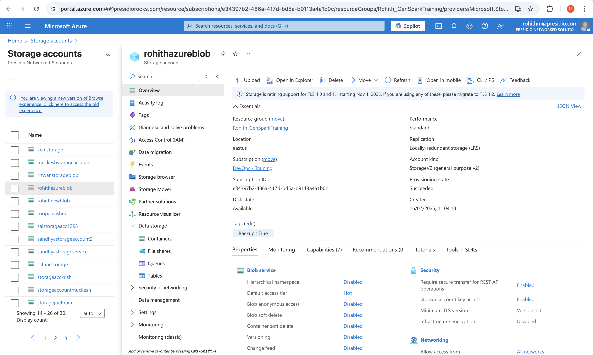

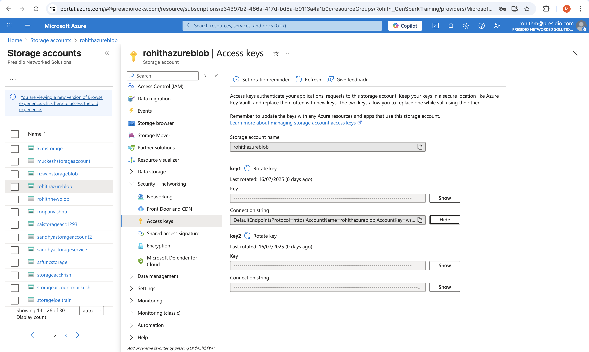

- Copy one of the connection string

```
DefaultEndpointsProtocol=https;AccountName=rohithazureblob;AccountKey=wsD2DWCF1cUfQ4RqVqthy4MnTfY4v6/L3KrO6FvnBH4Zs2RFiakvpFiM8Dx8HoG3/mJs5M16rVwI+AStDFruMw==;EndpointSuffix=core.windows.net
```

### Create Container 

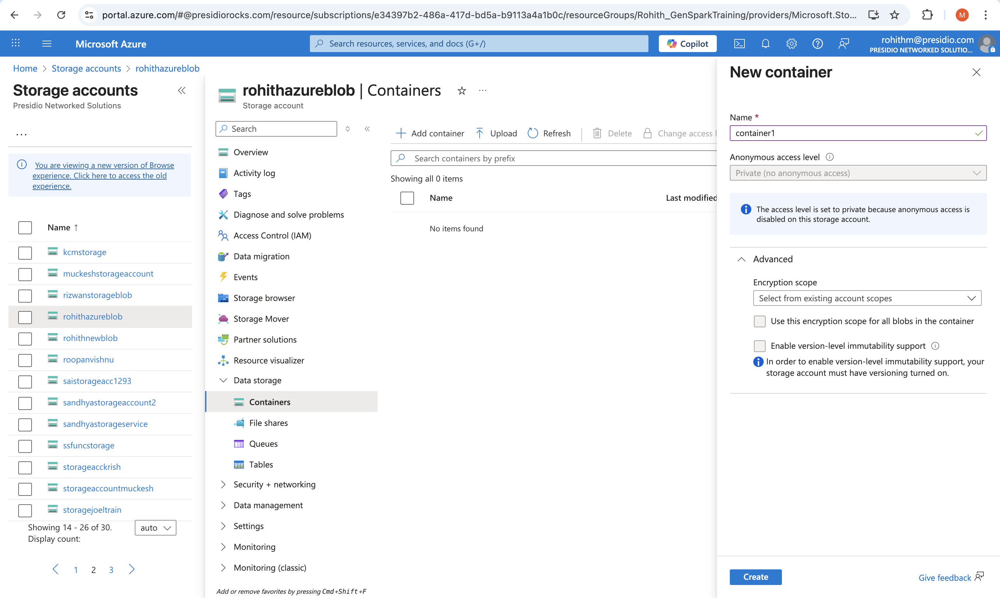

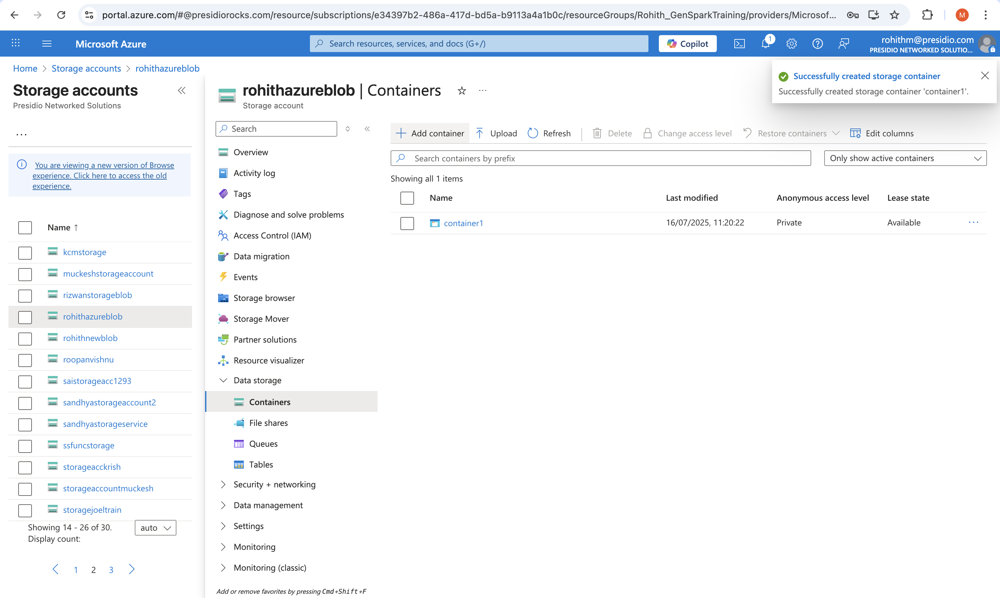

### Copy the key-vault uri

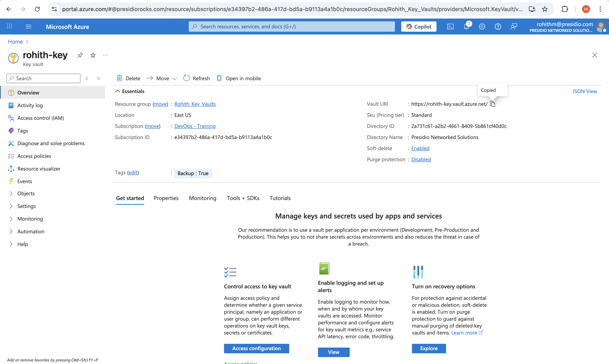

```
https://rohith-key.vault.azure.net/
```

### terminal

```
az functionapp config appsettings set  --name rohithdotnetfunc --resource-group Rohith_GenSparkTraining --settings AzureStorageConnectionString="DefaultEndpointsProtocol=https;AccountName=rohithazureblob;AccountKey=wsD2DWCF1cUfQ4RqVqthy4MnTfY4v6/L3KrO6FvnBH4Zs2RFiakvpFiM8Dx8HoG3/mJs5M16rVwI+AStDFruMw==;EndpointSuffix=core.windows.net" ContainerName="container1" KeyVaultUri="https://rohith-key.vault.azure.net/"
```

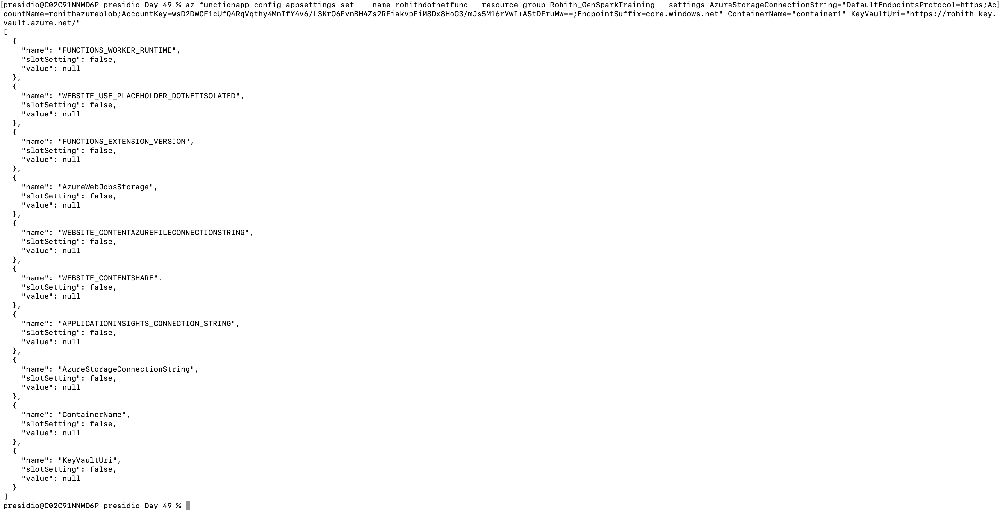


## Develop Azure Functions locally using Core Tools

https://learn.microsoft.com/en-us/azure/azure-functions/functions-run-local?tabs=macos%2Cisolated-process%2Cnode-v4%2Cpython-v2%2Chttp-trigger%2Ccontainer-apps&pivots=programming-language-csharp

### Install the Azure Functions Core Tools

```
brew tap azure/functions
brew install azure-functions-core-tools@4
# if upgrading on a machine that has 2.x or 3.x installed:
brew link --overwrite azure-functions-core-tools@4
```

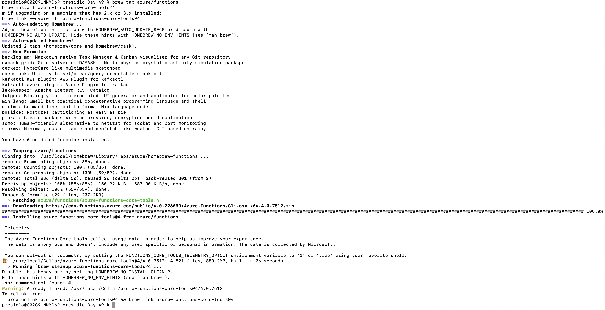


### Create your local project

- Install Azure Functions .NET templates

```
dotnet new install Microsoft.Azure.Functions.Worker.ProjectTemplates
```

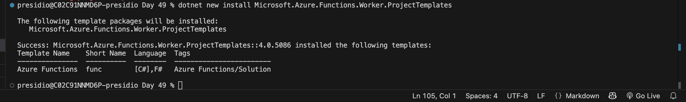

```
func init ./RohithProjFolder --worker-runtime dotnet-isolated --target-framework net8.0
```

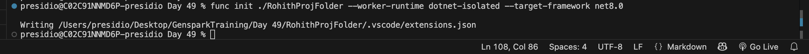

### Navigate into the project:

```
cd RohithProjFolder
```

### Create a function

```
func new --name BlobSasFunction --template "HTTP trigger"
```

### Manually Create BlobSasFunction.cs

```
using Azure.Identity;
using Azure.Security.KeyVault.Secrets;
using Azure.Storage;
using Azure.Storage.Blobs;
using Azure.Storage.Sas;
using Microsoft.Azure.Functions.Worker;
using Microsoft.Azure.Functions.Worker.Http;
using Microsoft.Extensions.Logging;
using System.Net;

namespace RohithProjFolder;

public class BlobSasFunction
{
    private readonly ILogger<BlobSasFunction> _logger;

    public BlobSasFunction(ILogger<BlobSasFunction> logger)
    {
        _logger = logger;
    }

    [Function("Function")] // this is the name used in Azure
    public async Task<HttpResponseData> Run(
        [HttpTrigger(AuthorizationLevel.Function, "get", Route = "generate-sas/{blobName}")] HttpRequestData req,
        string blobName)
    {
        _logger.LogInformation($"Generating SAS for blob: {blobName}");

        string connectionString = Environment.GetEnvironmentVariable("AzureStorageConnectionString");
        string containerName = Environment.GetEnvironmentVariable("ContainerName");
        string keyVaultUri = Environment.GetEnvironmentVariable("KeyVaultUri");

        if (string.IsNullOrEmpty(connectionString) || string.IsNullOrEmpty(containerName) || string.IsNullOrEmpty(keyVaultUri))
        {
            var errorResponse = req.CreateResponse(HttpStatusCode.InternalServerError);
            await errorResponse.WriteStringAsync("Missing required configuration settings.");
            return errorResponse;
        }

        var blobServiceClient = new BlobServiceClient(connectionString);
        var accountName = blobServiceClient.AccountName;

        string accountKey = null;
        foreach (var part in connectionString.Split(';'))
        {
            if (part.StartsWith("AccountKey=", StringComparison.OrdinalIgnoreCase))
            {
                accountKey = part.Substring("AccountKey=".Length);
                break;
            }
        }

        if (string.IsNullOrEmpty(accountKey))
        {
            var errorResponse = req.CreateResponse(HttpStatusCode.InternalServerError);
            await errorResponse.WriteStringAsync("AccountKey not found in connection string.");
            return errorResponse;
        }

        var credential = new StorageSharedKeyCredential(accountName, accountKey);
        var blobClient = blobServiceClient.GetBlobContainerClient(containerName).GetBlobClient(blobName);

        DateTimeOffset expiresOn = DateTimeOffset.UtcNow.AddHours(1);
        var sasBuilder = new BlobSasBuilder
        {
            BlobContainerName = containerName,
            BlobName = blobName,
            Resource = "b",
            ExpiresOn = expiresOn
        };
        sasBuilder.SetPermissions(BlobSasPermissions.Read | BlobSasPermissions.Write);

        var sasUri = blobClient.GenerateSasUri(sasBuilder);

        var secretClient = new SecretClient(new Uri(keyVaultUri), new DefaultAzureCredential());
        string secretName = "rohithazureblob";

        var secretToStore = new KeyVaultSecret(secretName, sasUri.ToString())
        {
            Properties =
            {
                Tags = { { "ExpiresOn", expiresOn.UtcDateTime.ToString("o") } }
            }
        };

        await secretClient.SetSecretAsync(secretToStore);

        var response = req.CreateResponse(HttpStatusCode.OK);
        await response.WriteAsJsonAsync(new
        {
            sasUrl = sasUri.ToString(),
            expiresOn
        });

        return response;
    }
}

```

### RohithProjFolder.csproj

```
<Project Sdk="Microsoft.NET.Sdk">
  <PropertyGroup>
    <TargetFramework>net8.0</TargetFramework>
    <AzureFunctionsVersion>V4</AzureFunctionsVersion>
    <OutputType>Exe</OutputType>
    <ImplicitUsings>enable</ImplicitUsings>
    <Nullable>enable</Nullable>
  </PropertyGroup>
  <ItemGroup>
    <FrameworkReference Include="Microsoft.AspNetCore.App" />
    <PackageReference Include="Azure.Security.KeyVault.Secrets" Version="4.8.0" />
    <PackageReference Include="Azure.Storage.Blobs" Version="12.25.0" />
    <PackageReference Include="Microsoft.ApplicationInsights.WorkerService" Version="2.23.0" />
    <PackageReference Include="Microsoft.Azure.Functions.Worker" Version="2.0.0" />
    <PackageReference Include="Microsoft.Azure.Functions.Worker.ApplicationInsights" Version="2.0.0" />
    <PackageReference Include="Microsoft.Azure.Functions.Worker.Extensions.Http.AspNetCore" Version="2.0.1" />
    <PackageReference Include="Microsoft.Azure.Functions.Worker.Sdk" Version="2.0.2" />
	   <PackageReference Include="Azure.Identity" Version="1.14.2" />
	  
  </ItemGroup>
</Project>
```

### local.settings.json

```
{
    "IsEncrypted": false,
    "Values": {
        "AzureWebJobsStorage": "UseDevelopmentStorage=true",
        "FUNCTIONS_WORKER_RUNTIME": "dotnet-isolated",
         "AzureFunctionsJobHost__Logging__Console__IsEnabled": "true",
        "AzureStorageConnectionString": "DefaultEndpointsProtocol=https;AccountName=rohithazureblob;AccountKey=wsD2DWCF1cUfQ4RqVqthy4MnTfY4v6/L3KrO6FvnBH4Zs2RFiakvpFiM8Dx8HoG3/mJs5M16rVwI+AStDFruMw==;EndpointSuffix=core.windows.net",
        "ContainerName": "container1",
        "KeyVaultUri": "https://rohith-key.vault.azure.net/"
    }
}
```

### terminal

```
func start
```

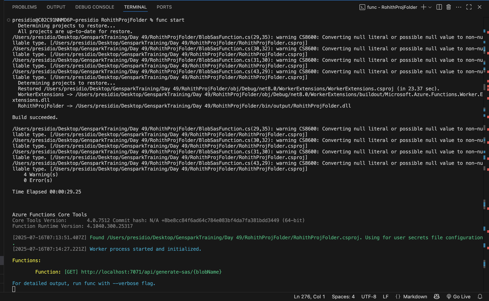


### Visit: http://localhost:7071/api/generate-sas/%7BblobName%7D

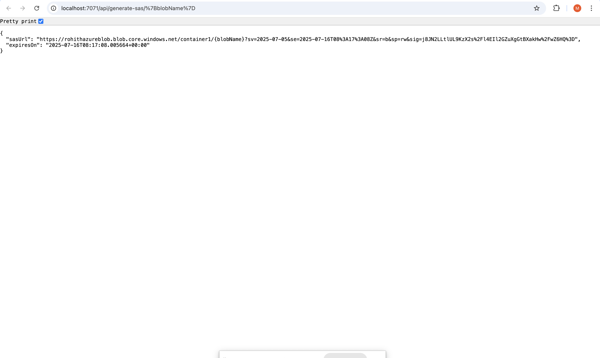

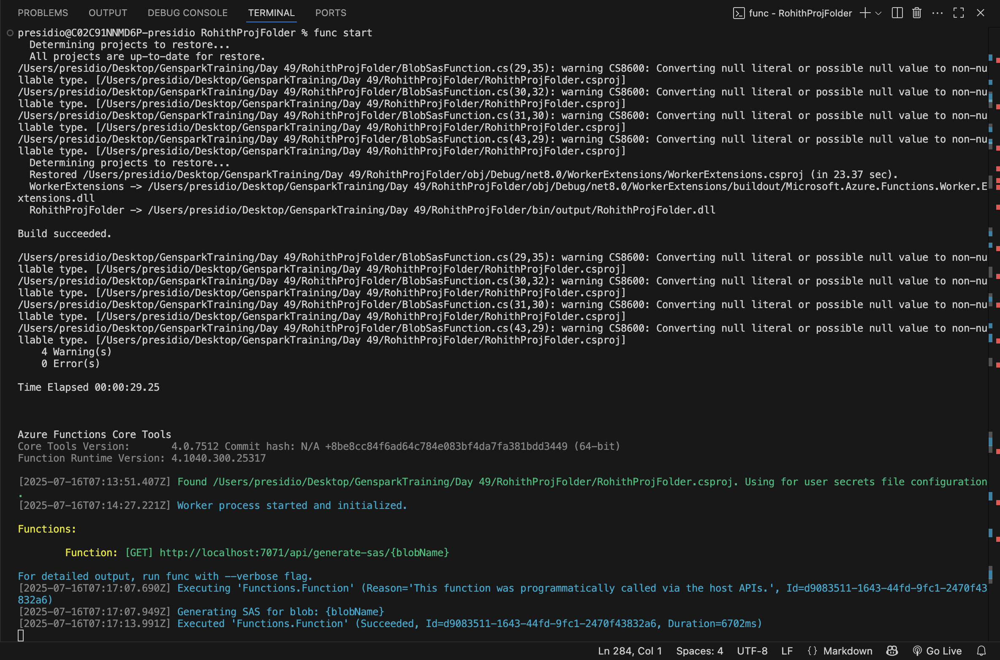


### Publish using Azure Functions Core Tools

```
func azure functionapp publish rohithdotnetfunc
```

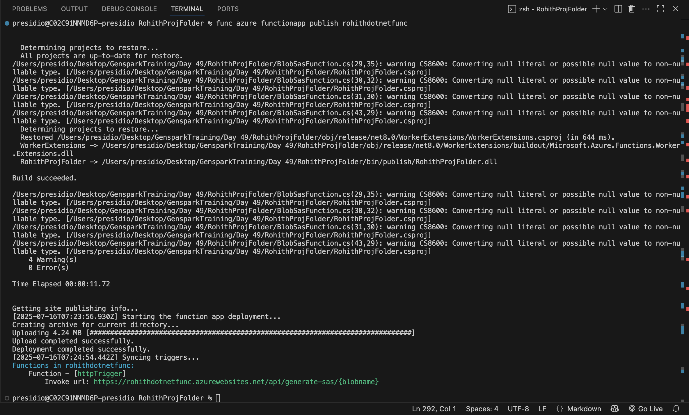

## list the function-level keys 

```
az functionapp function keys list --resource-group Rohith_GenSparkTraining --name rohithdotnetfunc --function-name Function
```

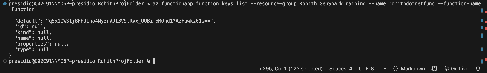

## streams the real-time logs

```
func azure functionapp logstream rohithdotnetfunc --output json
```

- func azure functionapp logstream → Connects your terminal to Azure to tail live logs from your function app.

- rohithdotnetfunc → This is the name of your Azure Function App deployed on Azure.

- --output json → Formats the logs in JSON structure (though usually this has limited impact for log streaming).

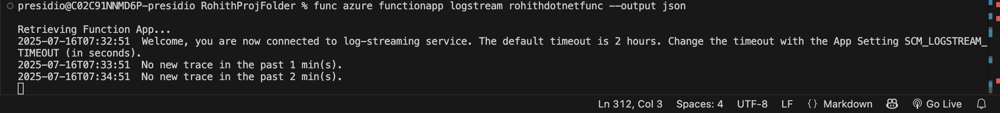


## Enable System-Assigned Managed Identity for the Function App

```
az functionapp identity assign \
  --name rohithdotnetfunc \
  --resource-group Rohith_GenSparkTraining
```

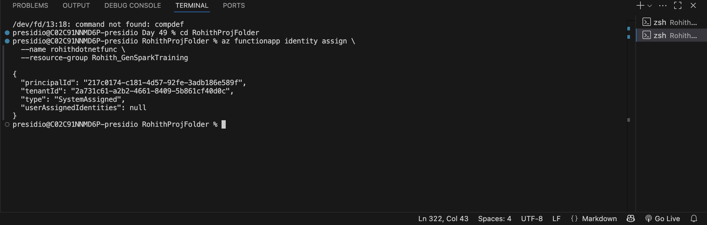

-  This enables System-Assigned Identity and outputs the principalId (used in Key Vault access).

```
object-id is principalId
```

## Give the Function Access to the Key Vault

- grant the Function App get and set permissions on secrets in your Key Vault (rohith-key).

```
az keyvault set-policy \
  --name rohith-key \
  --object-id 217c0174-c181-4d57-92fe-3adb186e589f \
  --secret-permissions get set
```

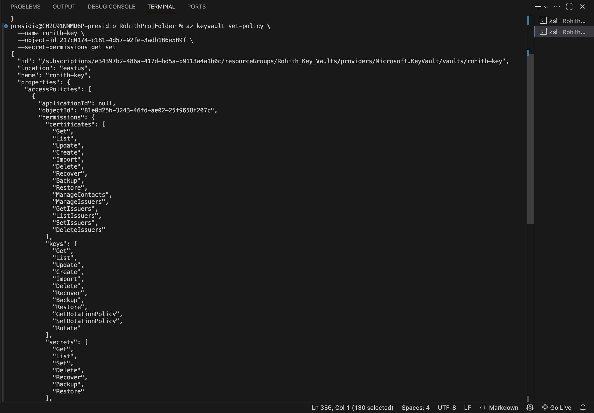

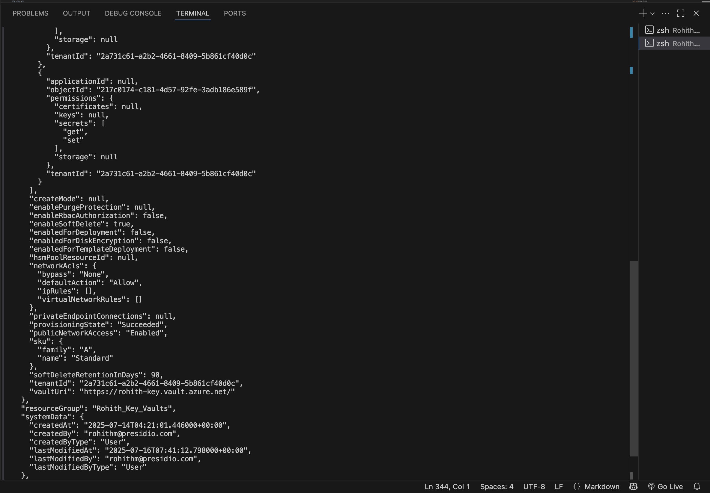

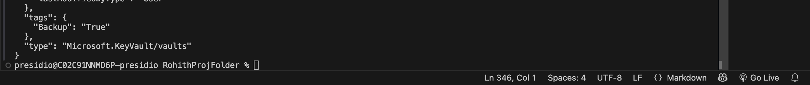


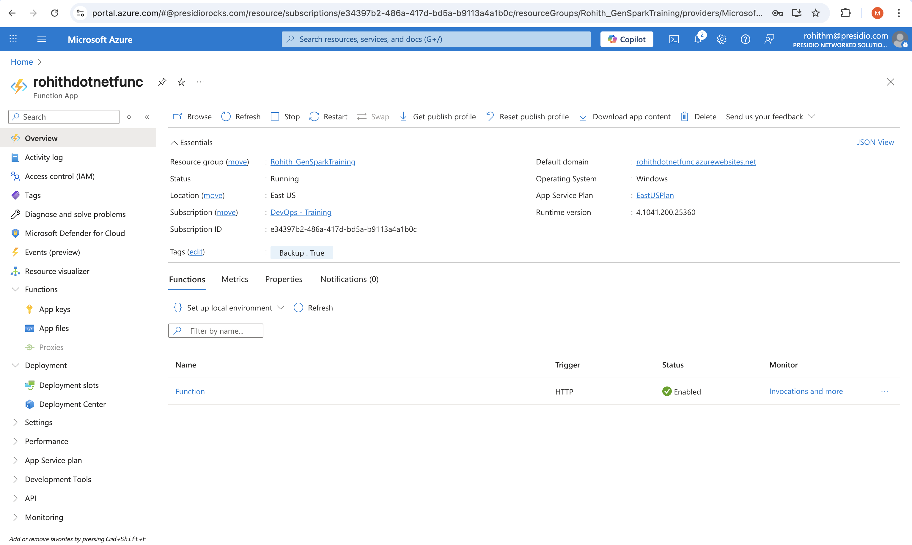


## Integrating the Blob API 

### appsettings.json

```
{
  "AzureBlob": {
    "KeyVaultUrl": "https://rohith-key.vault.azure.net/"
  },
  "Logging": {
    "LogLevel": {
      "Default": "Information",
      "Microsoft.AspNetCore": "Warning"
    }
  },
  "AllowedHosts": "*"
}
```

### to get the function url

```
https://rohithdotnetfunc.azurewebsites.net/api/generate-sas/{fileName}?code=q5x1QWSIj8HhJIho4Ny3rVJI3VStRVx_UUBiTdMQhd1MAzFuwkz01w==
```

- Run the following command

```
az functionapp function keys list --resource-group Rohith_GenSparkTraining --name rohithdotnetfunc --function-name Function;       
```

- Copy paste the code and use it after ?code= in url and make a note to provide ur function name


### Services/BlobStorageService.cs

```
using Azure.Storage.Blobs;
using BlobAPI.Models;

namespace BlobAPI.Services
{
    public class BlobStorageService
    {
        private readonly IConfiguration _configuration;
        private readonly IHttpClientFactory _httpClientFactory;
        private readonly ILogger<BlobStorageService> _logger;

        public BlobStorageService(
            IConfiguration configuration,
            IHttpClientFactory httpClientFactory,
            ILogger<BlobStorageService> logger)
        {
            _configuration = configuration;
            _httpClientFactory = httpClientFactory;
            _logger = logger;
        }

        private async Task<BlobClient> GetBlobClientWithSas(string fileName)
        {
            string functionUrl = $"https://rohithdotnetfunc.azurewebsites.net/api/generate-sas/{fileName}?code=q5x1QWSIj8HhJIho4Ny3rVJI3VStRVx_UUBiTdMQhd1MAzFuwkz01w==";
            var client = _httpClientFactory.CreateClient();
            var sasResponse = await client.GetAsync(functionUrl);
            if (!sasResponse.IsSuccessStatusCode)
            {
                var error = await sasResponse.Content.ReadAsStringAsync();
                _logger.LogError($"Failed to get SAS URL: {error}");
                throw new InvalidOperationException("Could not obtain SAS URL.");
            }

            var sasData = await sasResponse.Content.ReadFromJsonAsync<SasResponse>();
            if (sasData == null || string.IsNullOrWhiteSpace(sasData.sasUrl))
            {
                throw new InvalidOperationException("SAS URL response invalid.");
            }

            _logger.LogInformation($"SAS URL obtained: {sasData.sasUrl}");

            // Create BlobClient directly using the SAS URL
            return new BlobClient(new Uri(sasData.sasUrl));
        }

        public async Task UploadFile(Stream fileStream, string fileName)
        {
            var blobClient = await GetBlobClientWithSas(fileName);
            await blobClient.UploadAsync(fileStream, overwrite: true);
        }

        public async Task<Stream> DownloadFile(string fileName)
        {
            var blobClient = await GetBlobClientWithSas(fileName);
            if (await blobClient.ExistsAsync())
            {
                var downloadInfo = await blobClient.DownloadStreamingAsync();
                return downloadInfo.Value.Content;
            }
            return null;
        }
    }
}
```

### Controllers/FileController.cs

```
using BlobAPI.Models;
using BlobAPI.Services;
using Microsoft.AspNetCore.Http;
using Microsoft.AspNetCore.Mvc;
using System.ComponentModel.DataAnnotations;

namespace BlobAPI.Controllers
{
    [Route("api/[controller]")]
    [ApiController]
    public class FilesController : ControllerBase
    {
        private readonly BlobStorageService _blobStorageService;

        public FilesController(BlobStorageService blobStorageService)
        {
            _blobStorageService  = blobStorageService;
        }
        [HttpGet]
        public async Task<IActionResult> Download(string fileName)
        {
            var stream = await _blobStorageService.DownloadFile(fileName);
            if (stream == null) 
                return NotFound();
            return File(stream, "application/octet-stream", fileName);
        }

        [Consumes("multipart/form-data")]
        
        [HttpPost("upload")]

        public async Task<IActionResult> Upload([FromForm] UploadRequestDto request)
        {
            if (request.File == null || request.File.Length == 0)
                return BadRequest("No file to upload");
            using var stream = request.File.OpenReadStream();
            await _blobStorageService.UploadFile(stream, request.File.FileName);
            return Ok("File uploaded");
        }
    }
}
```

### Models/SasRespinse.cs

```
namespace BlobAPI.Models
{
    public class SasResponse
    {
        public string sasUrl { get; set; }
        public DateTimeOffset expiresOn { get; set; }
    }
}
```

### Models/UploadRequestDto.cs

```
namespace BlobAPI.Models
{
    public class UploadRequestDto
    {
        public IFormFile File { get; set; }
    }
}
```

### terminal

```
func azure functionapp logstream rohithdotnetfunc --output json
```

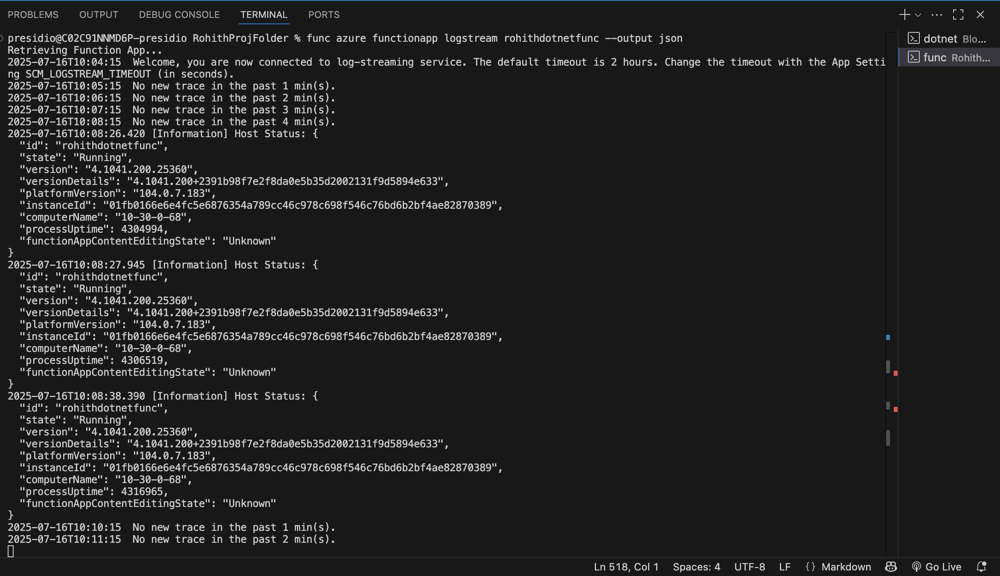


- Open a new terminal and inside the BlobAPI directory

```
dotnet run
```

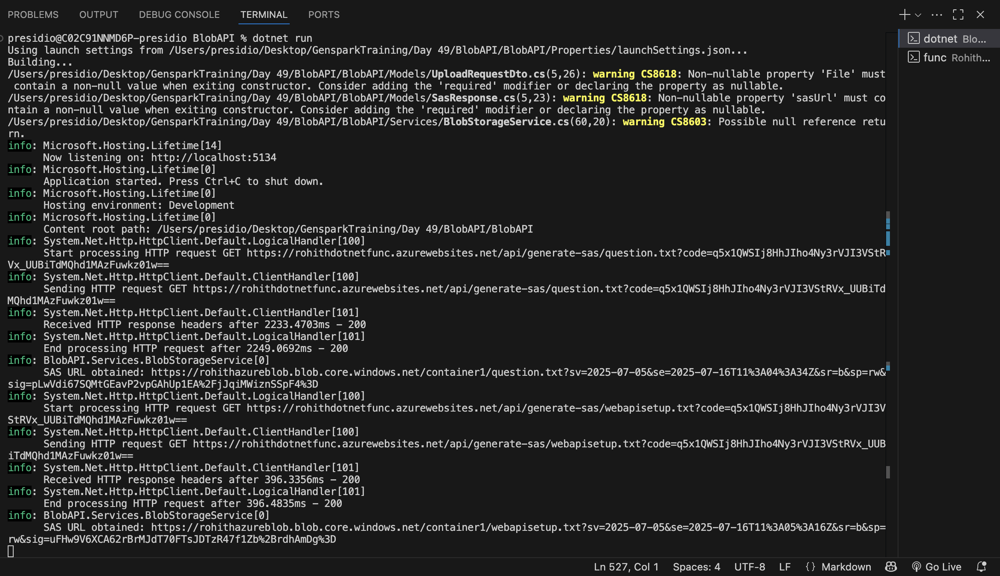

- Visit: http://localhost:5134/swagger/index.html

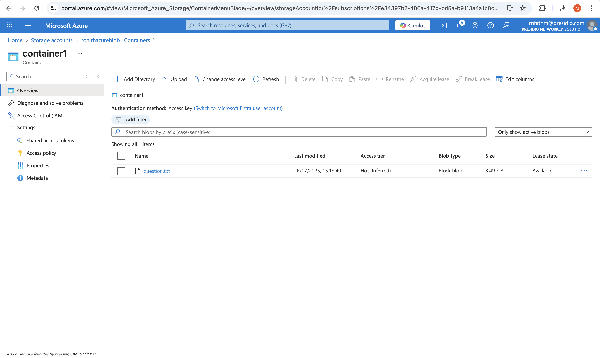

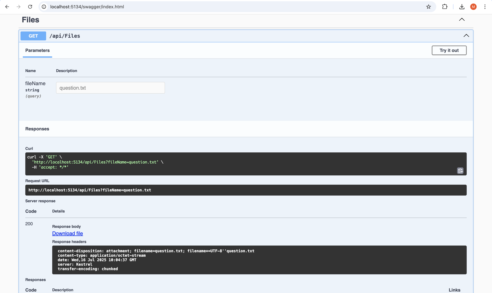

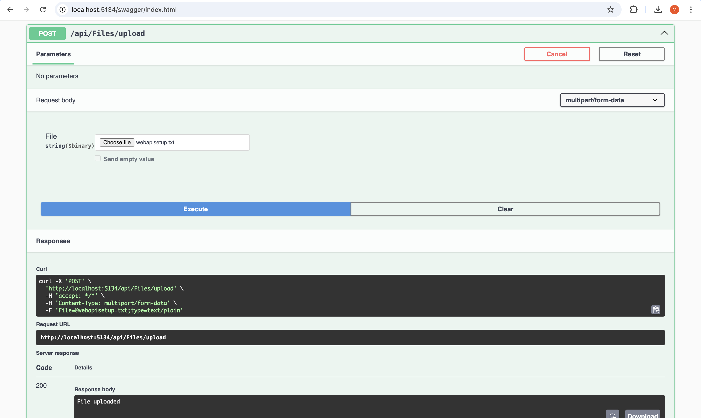


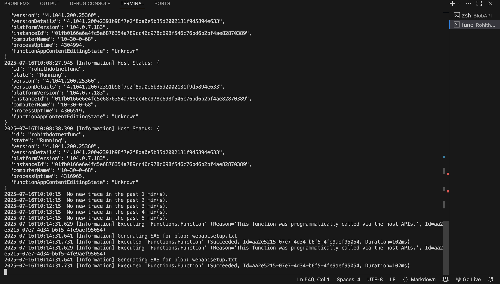

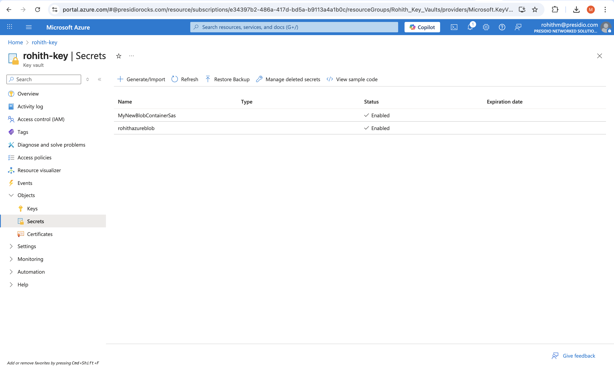

