# Deploy an Azure container registry

https://learn.microsoft.com/en-in/training/modules/build-and-store-container-images/

## 1. Create an Azure container registry

1. Launch Azure Cloud Shell and sign in to your Azure account using the az login command.

```
az login
```

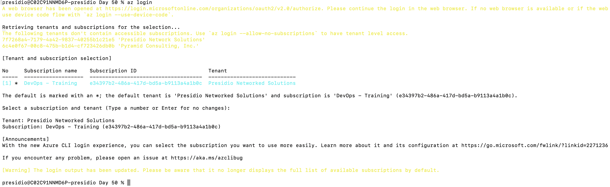


2. Create a resource group named rohith_learn-acr-rg to hold the resources for this module using the az group create command.

```
az group create --name rohith_learn-acr-rg --location eastus
```

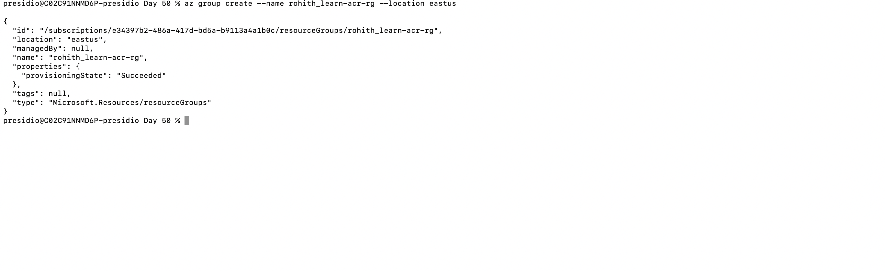

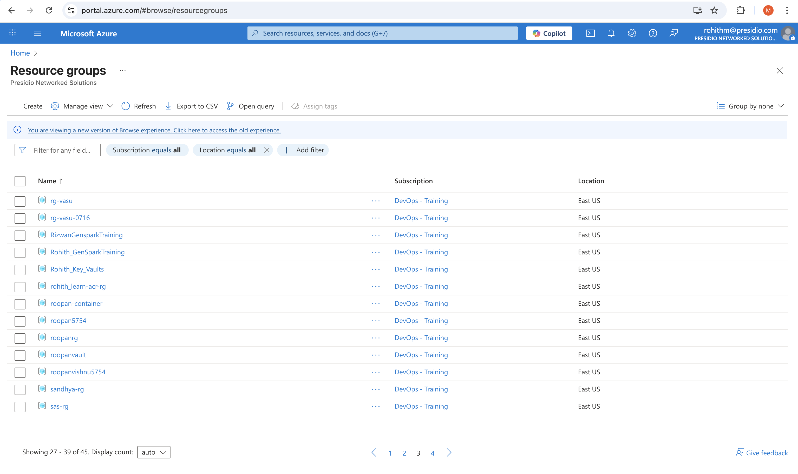

3. Define an environment variable, ACR_NAME, to hold your container registry name using the following command. The name must be unique within Azure and contain 5-50 alphanumeric characters.

```
ACR_NAME=rohith20250717acr
```

4. Create an Azure container registry using the az acr create command.

```
az acr create --resource-group rohith_learn-acr-rg --name $ACR_NAME --sku Premium
```

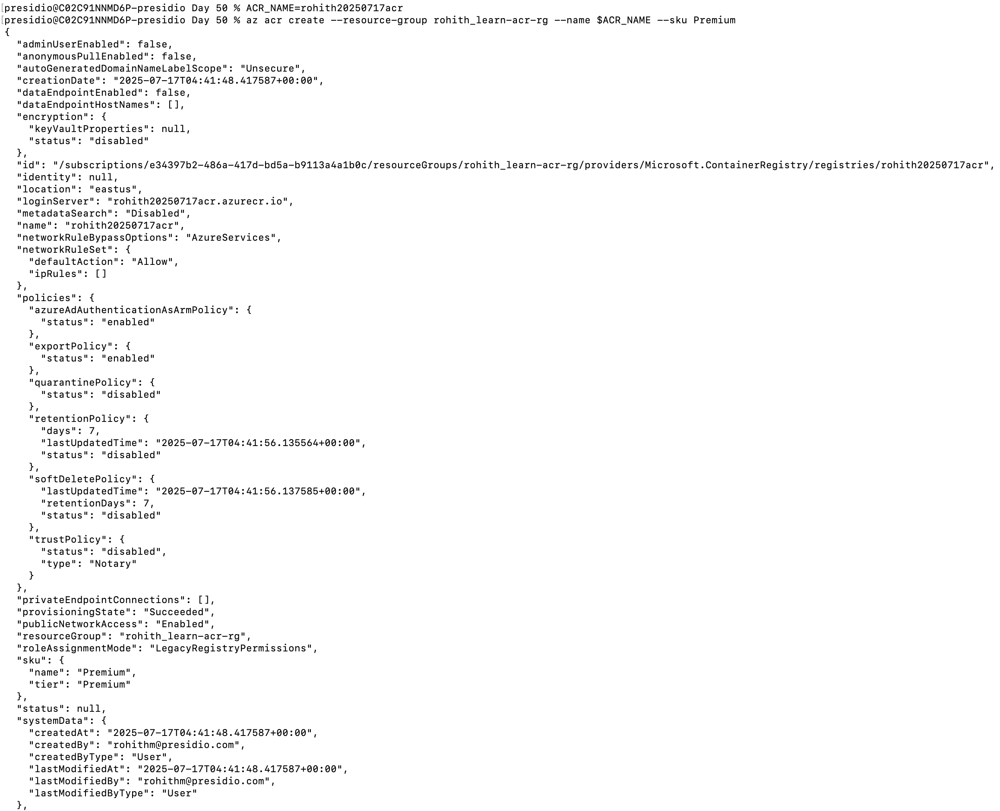

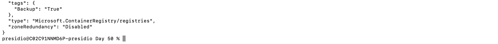

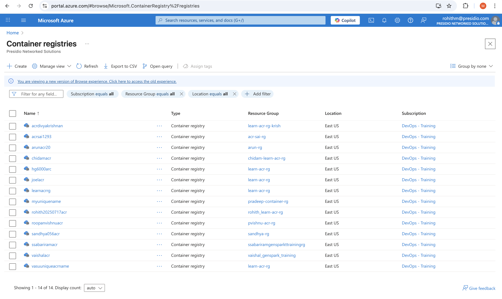

## 2. Create a container image using Azure Container Registry Tasks

1. You use a Dockerfile to provide build instructions. Azure Container Registry Tasks enables you to reuse any Dockerfile currently in your environment, including multi-staged builds. For this example, you create a new Dockerfile that builds a Node.js application.

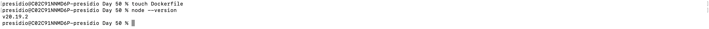

2. This Dockerfile uses the node:9-alpine image as its base image. It then adds the Node.js application files to the image and installs the application dependencies. Finally, it configures the container to serve the application on port 80 via the EXPOSE instruction.

### Dockerfile

```
FROM    node:9-alpine
ADD     https://raw.githubusercontent.com/Azure-Samples/acr-build-helloworld-node/master/package.json /
ADD     https://raw.githubusercontent.com/Azure-Samples/acr-build-helloworld-node/master/server.js /
RUN     npm install
EXPOSE  80
CMD     ["node", "server.js"]
```

3. Build the container image from the Dockerfile using the az acr build command.

Make sure you add the period (.) to the end of the command. It represents the source directory containing the Dockerfile. Because we didn't specify the name of the file using the --file parameter, the command looks for a file called Dockerfile in our current directory.

```
az acr build --registry $ACR_NAME --image helloacrtasks:v1 .
```

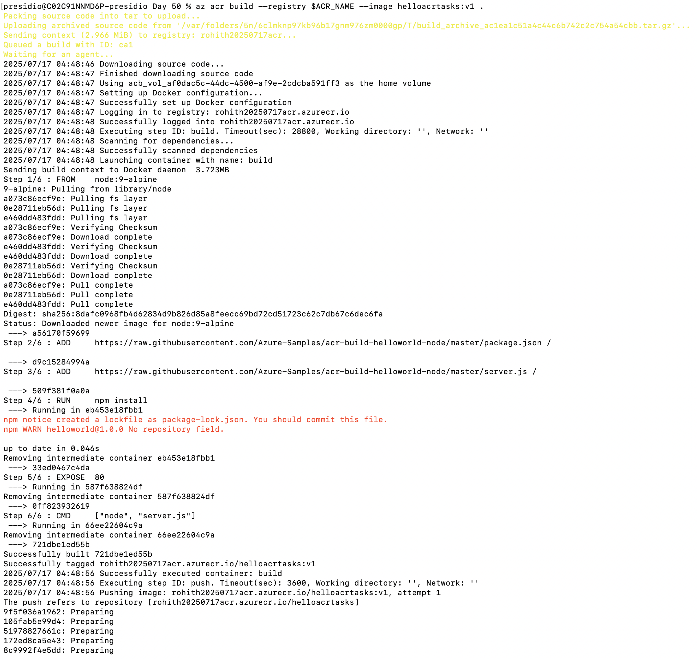

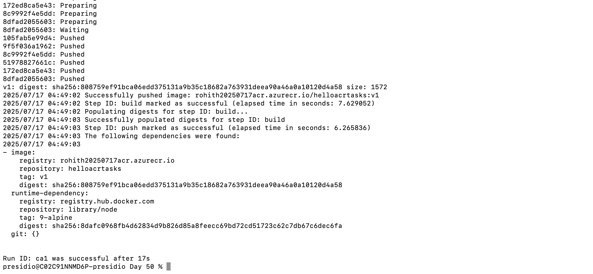

## 3. Registry authentication

- Azure Container Registry doesn't support unauthenticated access and requires authentication for all operations. Registries support two types of identities:

1.  Microsoft Entra identities, including both user and service principals. Access to a registry with a Microsoft Entra identity is role-based, and you can assign identities one of three roles: reader (pull access only), contributor (push and pull access), or owner (pull, push, and assign roles to other users).

2. The admin account included with each registry. The admin account is disabled by default.

### Enable the registry admin account

1. Enable the admin account on your registry using the az acr update command.

```
az acr update -n $ACR_NAME --admin-enabled true
```

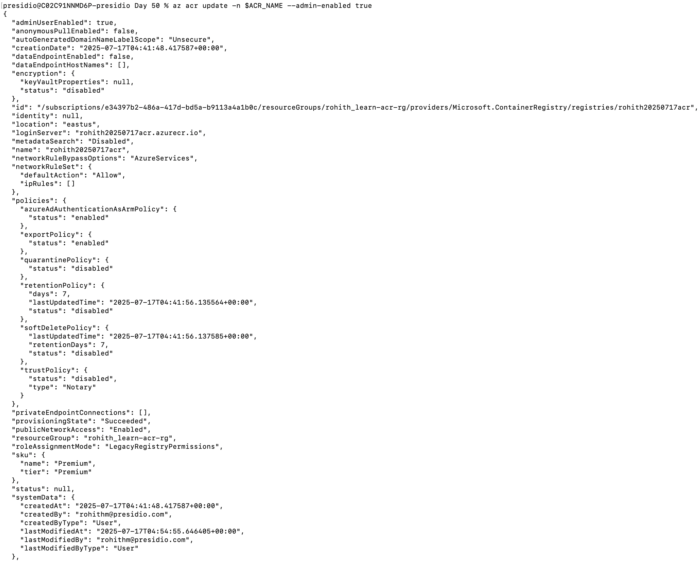

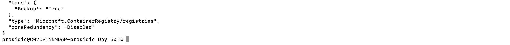

2. Retrieve the username and password for the admin account using the az acr credential show command.

```
az acr credential show --name $ACR_NAME
```

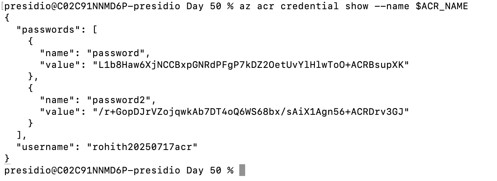

```
"passwords": [
    {
      "name": "password",
      "value": "L1b8Haw6XjNCCBxpGNRdPFgP7kDZ2OetUvYlHlwToO+ACRBsupXK"
    },
    {
      "name": "password2",
      "value": "/r+GopDJrVZojqwkAb7DT4oQ6WS68bx/sAiX1Agn56+ACRDrv3GJ"
    }
  ],
  "username": "rohith20250717acr"
```

### Deploy a container with Azure CLI

1. Deploy a container instance using the az container create command. Make sure you replace <admin-username> and <admin-password> with your admin username and password from the previous command.

```
az container create --resource-group rohith_learn-acr-rg --name acr-tasks --image $ACR_NAME.azurecr.io/helloacrtasks:v1 --registry-login-server $ACR_NAME.azurecr.io --ip-address Public --location eastus --registry-username rohith20250717acr --registry-password L1b8Haw6XjNCCBxpGNRdPFgP7kDZ2OetUvYlHlwToO+ACRBsupXK --os-type Linux --cpu 1 --memory 1
```

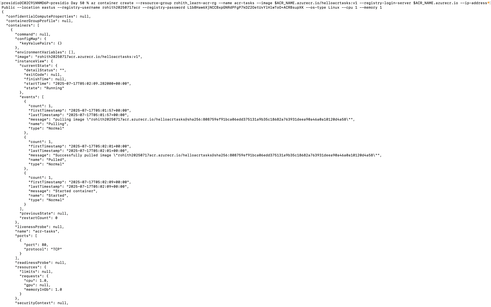

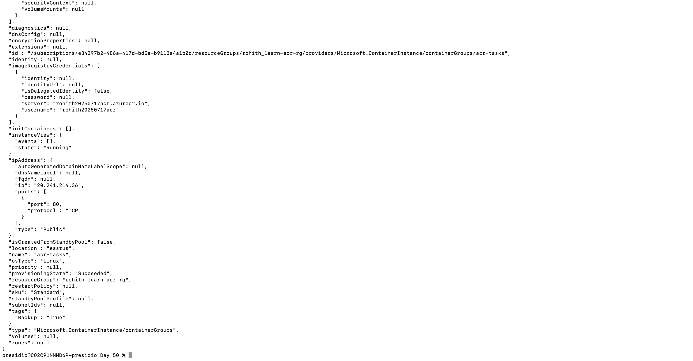

2. Get the IP address of the Azure container instance using the az container show command.


```
az container show --resource-group rohith_learn-acr-rg --name acr-tasks --query ipAddress.ip --output table
```

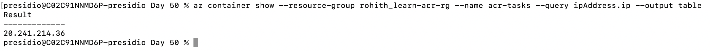

3. In a separate browser tab, navigate to the IP address of the container. If everything is configured correctly, you should see the following web page:

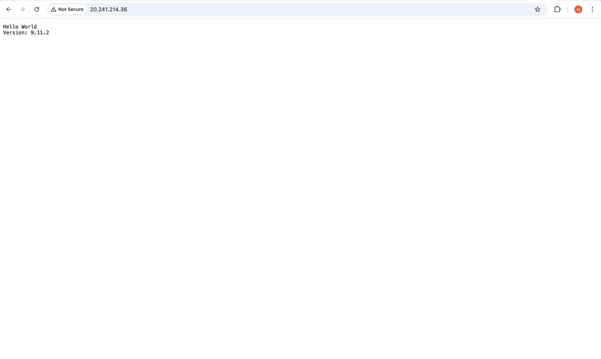


## 4. Create a replicated region for an Azure Container Registry

1. Replicate your registry to another region using the az acr replication create command. In this example, we replicate to the japaneast region.

```
az acr replication create --registry $ACR_NAME --location westus2
```

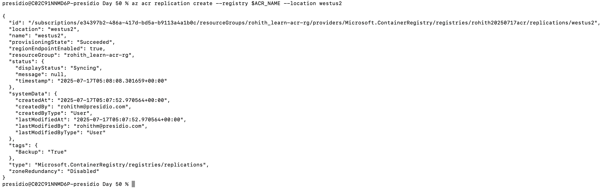


2. View all the container image replicas using the az acr replication list command.

```
az acr replication list --registry $ACR_NAME --output table
```

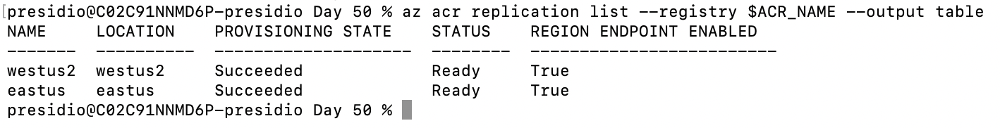


## 5. Clean up resources

1. Remove the resources you created in this module to avoid incurring charges. Deleting the resource group also deletes all its associated resources. Delete the resource group using the az group delete command.

```
az group delete --name rohith_learn-acr-rg --yes --no-wait
```

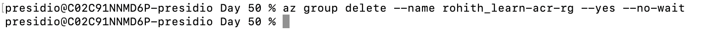

https://learn.microsoft.com/api/achievements/share/en-in/MRohith-0757/NVLSLGNF?sharingId=1D67478E06898E77

